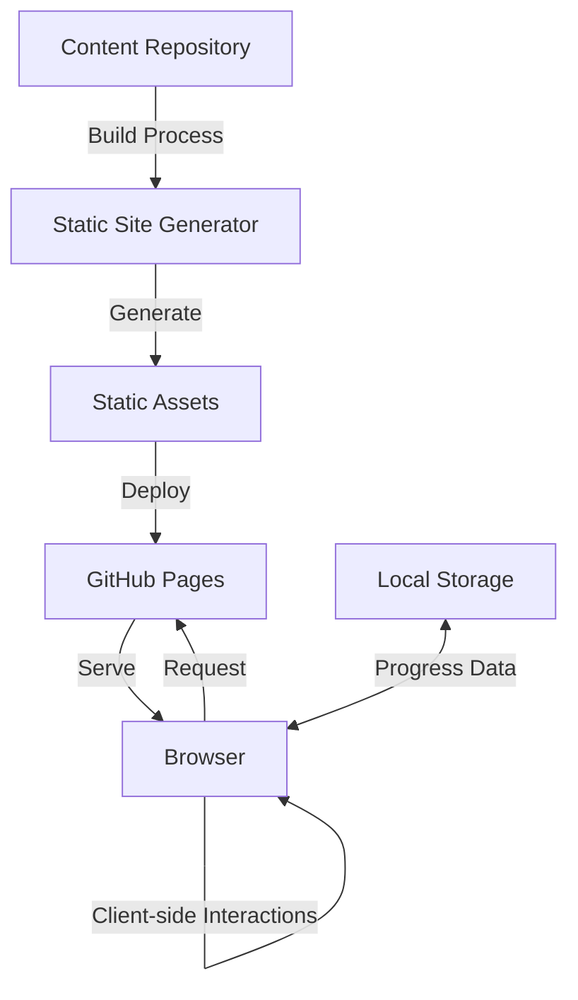
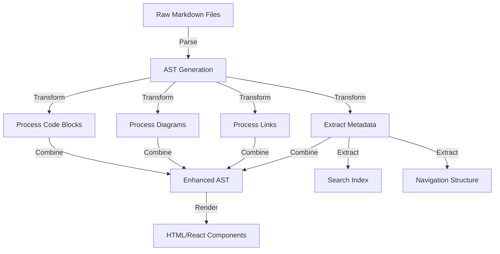

# Design Document: Frontend Interview Preparation Website

## Overview

This design document outlines the architecture, components, and implementation strategy for a comprehensive frontend interview preparation website. The website will serve as a personal learning platform to prepare for technical interviews at major tech companies, rendering all existing markdown content from the repository in a structured, searchable, and visually appealing manner. The platform will support comprehensive learning paths, include behavioral questions with answers, provide progress tracking capabilities, and feature dark mode for comfortable reading.

The website will be built using Next.js for server-side rendering and static site generation capabilities, React for the UI components, and will be deployed to GitHub Pages. The design prioritizes performance, accessibility, and a seamless user experience across devices.

## Architecture

### High-Level Architecture

The application will follow a JAMstack architecture (JavaScript, APIs, and Markup) with the following key components:



### Technical Stack

1. **Frontend Framework**: Next.js (React-based framework)

   - Provides static site generation (SSG) for optimal performance
   - Supports server-side rendering (SSR) when needed
   - Enables incremental static regeneration for content updates

2. **UI Components**: React with TypeScript

   - Type-safe component development
   - Reusable component architecture

3. **Styling**:

   - Tailwind CSS for utility-first styling
   - CSS Modules for component-specific styles
   - Theme provider for dark/light mode support

4. **Content Processing**:

   - MDX for enhanced markdown with React components
   - Remark/Rehype plugins for markdown transformations
   - Syntax highlighting with Prism or Highlight.js

5. **State Management**:

   - React Context API for theme and global state
   - Local Storage for persisting user progress and preferences

6. **Visualization**:

   - Mermaid.js for rendering diagrams from markdown
   - D3.js for interactive knowledge graphs and visualizations

7. **Search**:

   - Client-side search with Flexsearch or Lunr.js
   - Search index generated at build time

8. **Deployment**:
   - GitHub Actions for CI/CD pipeline
   - GitHub Pages for hosting

## Components and Interfaces

### Core Components

#### 1. Layout Components

- **MainLayout**: The primary layout wrapper that includes:

  - Header with navigation and theme toggle
  - Sidebar for content navigation
  - Main content area
  - Footer

- **ContentLayout**: Specialized layout for content pages with:
  - Table of contents
  - Previous/Next navigation
  - Related content links

#### 2. Navigation Components

- **TopNavigation**: Main navigation bar with:

  - Logo/Home link
  - Primary navigation links
  - Search toggle
  - Theme toggle

- **Sidebar**: Collapsible sidebar with:

  - Hierarchical content navigation
  - Current section indicator
  - Collapse/expand controls

- **Breadcrumbs**: Path-based navigation showing current location in content hierarchy

#### 3. Content Components

- **MarkdownRenderer**: Core component for rendering markdown content with:

  - Syntax highlighting for code blocks
  - Support for embedded components
  - Responsive image handling
  - Table formatting

- **CodeBlock**: Enhanced code display with:

  - Syntax highlighting
  - Copy button
  - Optional code execution for interactive examples

- **DiagramRenderer**: Component for rendering various diagram types:
  - Mermaid diagrams
  - Custom visualizations
  - Interactive knowledge graphs

#### 4. Learning Path Components

- **LearningPathView**: Displays structured learning paths with:

  - Sequential topic lists
  - Progress indicators
  - Estimated completion times

- **ProgressTracker**: Manages and displays user progress:
  - Completion checkmarks
  - Progress percentage
  - Next recommended topics

#### 5. Search Components

- **SearchBar**: Input and controls for search functionality
- **SearchResults**: Display of search results with highlighting and filtering options

#### 6. Interactive Components

- **QuizComponent**: For self-assessment on topics
- **CodePlayground**: For interactive code examples where applicable
- **AlgorithmVisualizer**: For visualizing algorithm execution

### Component Interfaces

#### MarkdownRenderer Interface

```typescript
interface MarkdownRendererProps {
  content: string; // Raw markdown content
  enableTOC?: boolean; // Whether to show table of contents
  enableSyntaxHighlighting?: boolean; // Whether to highlight code syntax
  enableDiagrams?: boolean; // Whether to render diagrams
}
```

#### LearningPath Interface

```typescript
interface LearningPathItem {
  id: string;
  title: string;
  description: string;
  path: string;
  estimatedMinutes: number;
  prerequisites: string[];
  topics: Array<{
    id: string;
    title: string;
    path: string;
    completed: boolean;
    estimatedMinutes: number;
  }>;
}
```

#### Progress Tracking Interface

```typescript
interface ProgressState {
  completedTopics: Record<string, boolean>;
  lastVisited: string;
  bookmarks: string[];
  notes: Record<string, string>;
}
```

## Data Models

### Content Model

The content will be organized in a hierarchical structure that mirrors the repository organization:

```typescript
interface ContentNode {
  id: string;
  title: string;
  path: string;
  type: "directory" | "file";
  children?: ContentNode[];
  metadata?: {
    description?: string;
    tags?: string[];
    category?: string;
    difficulty?: "beginner" | "intermediate" | "advanced";
    estimatedMinutes?: number;
  };
}
```

### Learning Path Model

Learning paths will be defined as structured sequences of content:

```typescript
interface LearningPath {
  id: string;
  title: string;
  description: string;
  levels: Array<{
    id: string;
    title: string;
    topics: Array<{
      id: string;
      title: string;
      contentPath: string;
      optional: boolean;
    }>;
  }>;
}
```

### User Progress Model

User progress will be stored in local storage:

```typescript
interface UserProgress {
  completedContent: Record<
    string,
    {
      completedAt: string;
      revisited: number;
    }
  >;
  learningPaths: Record<
    string,
    {
      currentTopic: string;
      progress: number;
    }
  >;
  preferences: {
    theme: "light" | "dark" | "system";
    fontSize: "small" | "medium" | "large";
  };
}
```

### Search Index Model

The search index will be pre-built at compile time:

```typescript
interface SearchIndexEntry {
  id: string;
  title: string;
  path: string;
  content: string;
  headings: Array<{
    text: string;
    level: number;
  }>;
  tags: string[];
  category: string;
}
```

## Content Processing Pipeline

The content processing pipeline will transform markdown files into renderable content:



## Routing Structure

The website will use Next.js file-based routing with a structure that mirrors the content organization:

```
/                           # Home page
/learn                      # Learning paths overview
/learn/[path]               # Specific learning path
/content/[...slug]          # Content pages (maps to repository structure)
/search                     # Search results page
/behavioral                 # Behavioral questions section
/algorithms                 # Algorithms section
/system-design              # System design section
/profile                    # User profile and progress
```

## Theme System

The theme system will support light and dark modes with a consistent color palette:

```typescript
interface ThemeColors {
  background: {
    primary: string;
    secondary: string;
    tertiary: string;
  };
  text: {
    primary: string;
    secondary: string;
    accent: string;
  };
  accent: {
    primary: string;
    secondary: string;
  };
  code: {
    background: string;
    text: string;
    comment: string;
    keyword: string;
    string: string;
    function: string;
    variable: string;
  };
}
```

## Error Handling

### Client-Side Error Handling

1. **Component Error Boundaries**: React error boundaries will be used to catch and handle errors in component trees.

2. **API Request Errors**: Axios interceptors or custom fetch wrappers will handle network request errors with appropriate user feedback.

3. **Content Rendering Errors**: Fallback components will be displayed when content fails to render properly.

### Build-Time Error Handling

1. **Content Validation**: Markdown content will be validated during the build process to catch formatting issues.

2. **Link Validation**: Internal links will be checked to ensure they point to valid content.

3. **Build Failure Handling**: GitHub Actions will be configured to notify on build failures and prevent deployment of broken builds.

## Testing Strategy

### Unit Testing

1. **Component Testing**: Jest and React Testing Library for testing individual components.

2. **Utility Function Testing**: Jest for testing helper functions and utilities.

### Integration Testing

1. **Page Composition Testing**: Testing how components work together on key pages.

2. **Content Rendering Testing**: Ensuring markdown content renders correctly with all features.

### End-to-End Testing

1. **User Flow Testing**: Cypress for testing critical user flows like navigation and search.

2. **Responsive Design Testing**: Testing the website across different viewport sizes.

### Performance Testing

1. **Lighthouse CI**: Automated performance testing in the CI pipeline.

2. **Bundle Size Monitoring**: Tracking JavaScript bundle size to prevent performance regressions.

## Deployment Strategy

### Build Process

1. **Content Processing**: Parse and transform markdown content into optimized formats.

2. **Static Site Generation**: Generate static HTML for all pages.

3. **Asset Optimization**: Optimize images, CSS, and JavaScript for production.

### GitHub Actions Workflow

```yaml
# Simplified workflow representation
name: Build and Deploy
on:
  push:
    branches: [main]
jobs:
  build-and-deploy:
    runs-on: ubuntu-latest
    steps:
      - name: Checkout
        uses: actions/checkout@v2

      - name: Setup Node.js
        uses: actions/setup-node@v2
        with:
          node-version: "16"

      - name: Install Dependencies
        run: npm ci

      - name: Build
        run: npm run build

      - name: Test
        run: npm test

      - name: Deploy to GitHub Pages
        uses: JamesIves/github-pages-deploy-action@4.1.4
        with:
          branch: gh-pages
          folder: out
```

## Performance Optimization

1. **Code Splitting**: Split JavaScript bundles by route for faster initial load times.

2. **Image Optimization**: Use Next.js image optimization for responsive images.

3. **Font Loading Strategy**: Use `font-display: swap` and preload critical fonts.

4. **Critical CSS**: Inline critical CSS for above-the-fold content.

5. **Lazy Loading**: Defer loading of off-screen content and non-critical resources.

## Accessibility Considerations

1. **Semantic HTML**: Use proper HTML elements for their intended purpose.

2. **ARIA Attributes**: Add ARIA attributes where necessary for complex interactive elements.

3. **Keyboard Navigation**: Ensure all interactive elements are keyboard accessible.

4. **Color Contrast**: Maintain WCAG 2.1 AA compliant color contrast ratios.

5. **Screen Reader Support**: Test with screen readers to ensure content is accessible.

## Future Enhancements

1. **User Accounts**: Optional user accounts for syncing progress across devices.

2. **Interactive Coding Challenges**: Expanded interactive code execution capabilities.

3. **Community Features**: Comments, discussions, or shared notes on content.

4. **Spaced Repetition**: Intelligent review scheduling for better retention.

5. **Mobile App**: Progressive Web App (PWA) or native mobile app version.
