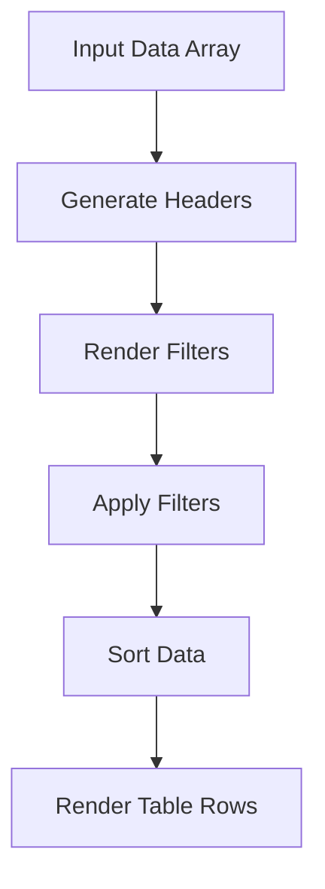

# Problem 1: Dynamic Table Generator

## Problem Description

Create a function that generates a dynamic table from an array of objects with sorting and filtering capabilities.

## Requirements

- Accept array of objects as input
- Generate table headers automatically from object keys
- Support sorting by any column
- Support filtering by any column
- Make it responsive

## Solution

```javascript
class DynamicTable {
  constructor(containerId, data) {
    this.container = document.getElementById(containerId);
    this.data = data;
    this.currentSort = { column: null, direction: "asc" };
    this.filters = {};
    this.init();
  }

  init() {
    this.render();
    this.attachEventListeners();
  }

  render() {
    if (!this.data.length) {
      this.container.innerHTML = "<p>No data available</p>";
      return;
    }

    const headers = Object.keys(this.data[0]);
    const filteredData = this.getFilteredData();
    const sortedData = this.getSortedData(filteredData);

    const tableHTML = `
      <div class="table-controls">
        <div class="filters">
          ${headers
            .map(
              (header) => `
            <input 
              type="text" 
              placeholder="Filter ${header}..."
              data-filter="${header}"
              class="filter-input"
            >
          `
            )
            .join("")}
        </div>
      </div>
      <table class="dynamic-table">
        <thead>
          <tr>
            ${headers
              .map(
                (header) => `
              <th data-sort="${header}" class="sortable">
                ${header}
                <span class="sort-indicator"></span>
              </th>
            `
              )
              .join("")}
          </tr>
        </thead>
        <tbody>
          ${sortedData
            .map(
              (row) => `
            <tr>
              ${headers
                .map(
                  (header) => `
                <td>${row[header]}</td>
              `
                )
                .join("")}
            </tr>
          `
            )
            .join("")}
        </tbody>
      </table>
    `;

    this.container.innerHTML = tableHTML;
  }

  getFilteredData() {
    return this.data.filter((row) => {
      return Object.keys(this.filters).every((filterKey) => {
        const filterValue = this.filters[filterKey].toLowerCase();
        const cellValue = String(row[filterKey]).toLowerCase();
        return cellValue.includes(filterValue);
      });
    });
  }

  getSortedData(data) {
    if (!this.currentSort.column) return data;

    return [...data].sort((a, b) => {
      const aVal = a[this.currentSort.column];
      const bVal = b[this.currentSort.column];

      if (typeof aVal === "string") {
        return this.currentSort.direction === "asc"
          ? aVal.localeCompare(bVal)
          : bVal.localeCompare(aVal);
      }

      return this.currentSort.direction === "asc" ? aVal - bVal : bVal - aVal;
    });
  }

  attachEventListeners() {
    // Sort event listeners
    this.container.addEventListener("click", (e) => {
      if (e.target.closest(".sortable")) {
        const header = e.target.closest(".sortable");
        const column = header.dataset.sort;

        if (this.currentSort.column === column) {
          this.currentSort.direction =
            this.currentSort.direction === "asc" ? "desc" : "asc";
        } else {
          this.currentSort.column = column;
          this.currentSort.direction = "asc";
        }

        this.render();
      }
    });

    // Filter event listeners
    this.container.addEventListener("input", (e) => {
      if (e.target.classList.contains("filter-input")) {
        const filterKey = e.target.dataset.filter;
        const filterValue = e.target.value;

        if (filterValue) {
          this.filters[filterKey] = filterValue;
        } else {
          delete this.filters[filterKey];
        }

        this.render();
      }
    });
  }
}

// Usage
const sampleData = [
  { name: "John", age: 25, city: "New York", salary: 50000 },
  { name: "Jane", age: 30, city: "Los Angeles", salary: 60000 },
  { name: "Bob", age: 35, city: "Chicago", salary: 55000 },
  { name: "Alice", age: 28, city: "Boston", salary: 65000 },
];

const table = new DynamicTable("table-container", sampleData);
```

## CSS Styling

```css
.dynamic-table {
  width: 100%;
  border-collapse: collapse;
  margin-top: 20px;
}

.dynamic-table th,
.dynamic-table td {
  padding: 12px;
  text-align: left;
  border-bottom: 1px solid #ddd;
}

.dynamic-table th {
  background-color: #f5f5f5;
  font-weight: bold;
  cursor: pointer;
  user-select: none;
}

.dynamic-table th:hover {
  background-color: #e9e9e9;
}

.sortable {
  position: relative;
}

.sort-indicator::after {
  content: "↕";
  position: absolute;
  right: 8px;
  color: #999;
}

.sortable[data-sort="name"].asc .sort-indicator::after {
  content: "↑";
  color: #007bff;
}

.sortable[data-sort="name"].desc .sort-indicator::after {
  content: "↓";
  color: #007bff;
}

.table-controls {
  margin-bottom: 20px;
}

.filters {
  display: flex;
  gap: 10px;
  flex-wrap: wrap;
}

.filter-input {
  padding: 8px 12px;
  border: 1px solid #ddd;
  border-radius: 4px;
  font-size: 14px;
}

@media (max-width: 768px) {
  .dynamic-table {
    font-size: 14px;
  }

  .dynamic-table th,
  .dynamic-table td {
    padding: 8px 6px;
  }

  .filters {
    flex-direction: column;
  }
}
```

## Key Features

1. **Automatic Header Generation**: Creates headers from object keys
2. **Sorting**: Click headers to sort by column
3. **Filtering**: Real-time filtering by any column
4. **Responsive Design**: Adapts to different screen sizes
5. **Performance**: Efficient rendering and event handling
6. **Accessibility**: Proper semantic HTML and keyboard navigation

## Advanced Usage

```javascript
// With custom styling
const customTable = new DynamicTable("custom-table", data);

// With custom cell renderers
class CustomTable extends DynamicTable {
  renderCell(value, column) {
    if (column === "salary") {
      return `$${value.toLocaleString()}`;
    }
    if (column === "age") {
      return `${value} years`;
    }
    return value;
  }
}
```

## Interview Deep Dive: Dynamic Table

### Follow-up Questions

1. **How would you add keyboard navigation for accessibility?**

   - Use `tabindex="0"` on rows and headers.
   - Add keyboard event listeners for arrow keys, Enter, and Escape.
   - Use ARIA roles: `role="table"`, `role="row"`, `role="columnheader"`, `role="cell"`.

2. **How would you handle large datasets (10,000+ rows)?**

   - Implement virtual scrolling (windowing) using libraries like `react-window` or custom logic.
   - Only render visible rows to improve performance.

3. **How would you support custom cell rendering (e.g., links, buttons, icons)?**

   - Allow passing a `renderCell` function as a prop or method override.
   - Example: `renderCell(value, column, row)`

4. **How would you make the table accessible for screen readers?**
   - Use semantic HTML: `<table>`, `<thead>`, `<tbody>`, `<th>`, `<td>`.
   - Add `scope="col"` to header cells.
   - Provide captions and summaries if needed.

---

### Diagram: Table Rendering Flow



---

### Advanced Problem: Virtualized Dynamic Table (React)

**Challenge:** Implement a dynamic table with virtual scrolling for large datasets in React.

**Solution Outline:**

- Use `react-window` or similar for windowing.
- Only render visible rows.
- Keep sorting/filtering logic in parent component.

**Sample Implementation:**

```jsx
import { FixedSizeList as List } from "react-window";

function VirtualizedTable({ data, height, rowHeight }) {
  const headers = Object.keys(data[0] || {});

  return (
    <div style={{ width: "100%" }}>
      <table className="dynamic-table">
        <thead>
          <tr>
            {headers.map((header) => (
              <th key={header}>{header}</th>
            ))}
          </tr>
        </thead>
      </table>
      <List
        height={height}
        itemCount={data.length}
        itemSize={rowHeight}
        width="100%"
      >
        {({ index, style }) => (
          <div style={style}>
            <table className="dynamic-table">
              <tbody>
                <tr>
                  {headers.map((header) => (
                    <td key={header}>{data[index][header]}</td>
                  ))}
                </tr>
              </tbody>
            </table>
          </div>
        )}
      </List>
    </div>
  );
}
```

---

### System Design: Table Component API

- `data`: Array of objects
- `columns`: Optional array of column configs (label, key, sortable, filterable, renderCell)
- `onSort`: Callback for sort changes
- `onFilter`: Callback for filter changes
- `rowKey`: Function or string for unique row id

---

## More Dynamic Table Interview Problems

### Problem 2: Editable Table Cells

**Question:** How would you allow users to edit table cells inline and save changes?

**Solution Outline:**

- Render each cell as a text input or select when in edit mode.
- Track editing state (row/column).
- Save changes on blur or Enter, revert on Escape.

**Sample Implementation (JS):**

```js
// In your DynamicTable class, add editing state and handlers
// Pseudocode for cell rendering:
renderCell(value, rowIdx, colKey) {
  if (this.editing && this.editing.row === rowIdx && this.editing.col === colKey) {
    return `<input value="${value}" onblur="saveEdit()" onkeydown="handleKey(event)" />`;
  }
  return `<span ondblclick="startEdit(${rowIdx}, '${colKey}')">${value}</span>`;
}
```

---

### Problem 3: Row Selection and Bulk Actions

**Question:** How would you implement row selection (single/multi) and bulk actions (delete, export)?

**Solution Outline:**

- Add a checkbox to each row and a master checkbox in the header.
- Track selected row IDs in state.
- Provide bulk action buttons (e.g., Delete Selected, Export Selected).

**Sample Implementation (JS):**

```js
// Add a 'selected' property to each row or track selected IDs in a Set
// Render checkboxes in the first column
// Add event listeners for bulk action buttons
```

---

### Problem 4: Column Reordering

**Question:** How would you allow users to reorder columns via drag-and-drop?

**Solution Outline:**

- Use HTML5 Drag and Drop API or a library (e.g., react-beautiful-dnd).
- Update the columns order in state on drop.
- Re-render table with new column order.

**Sample Implementation (React):**

```jsx
// Use react-beautiful-dnd's <DragDropContext> and <Droppable> for columns
// On drag end, update columns array order
```

---

### Problem 5: Server-Side Pagination and Filtering

**Question:** How would you handle tables with millions of rows (server-side pagination/filtering)?

**Solution Outline:**

- Fetch only the current page of data from the server.
- Send filter/sort params in API requests.
- Show loading indicators and handle errors.

**Sample API Call:**

```js
fetch(`/api/table?page=2&pageSize=50&sort=age&filter=city:Boston`)
  .then((res) => res.json())
  .then((data) => updateTable(data));
```

---

### Problem 6: Accessibility for Dynamic Tables

**Question:** What are the key accessibility considerations for dynamic tables?

**Answer:**

- Use semantic HTML (`<table>`, `<thead>`, `<tbody>`, `<th>`, `<td>`)
- Add ARIA roles and properties as needed
- Ensure keyboard navigation (tab, arrow keys)
- Provide visible focus indicators
- Announce changes to screen readers (e.g., row added/removed)

---

_These additional problems cover editing, selection, column reordering, server-side data, and accessibility—key areas for dynamic table interviews. Practice implementing and discussing these features!_

---

### Diagram: Table Rendering Flow


---

### Advanced Problem: Virtualized Dynamic Table (React)

**Challenge:** Implement a dynamic table with virtual scrolling for large datasets in React.

**Solution Outline:**

- Use `react-window` or similar for windowing.
- Only render visible rows.
- Keep sorting/filtering logic in parent component.

**Sample Implementation:**

```jsx
import { FixedSizeList as List } from "react-window";

function VirtualizedTable({ data, height, rowHeight }) {
  const headers = Object.keys(data[0] || {});

  return (
    <div style={{ width: "100%" }}>
      <table className="dynamic-table">
        <thead>
          <tr>
            {headers.map((header) => (
              <th key={header}>{header}</th>
            ))}
          </tr>
        </thead>
      </table>
      <List
        height={height}
        itemCount={data.length}
        itemSize={rowHeight}
        width="100%"
      >
        {({ index, style }) => (
          <div style={style}>
            <table className="dynamic-table">
              <tbody>
                <tr>
                  {headers.map((header) => (
                    <td key={header}>{data[index][header]}</td>
                  ))}
                </tr>
              </tbody>
            </table>
          </div>
        )}
      </List>
    </div>
  );
}
```

---

### System Design: Table Component API

- `data`: Array of objects
- `columns`: Optional array of column configs (label, key, sortable, filterable, renderCell)
- `onSort`: Callback for sort changes
- `onFilter`: Callback for filter changes
- `rowKey`: Function or string for unique row id

---

## More Dynamic Table Interview Problems

### Problem 2: Editable Table Cells

**Question:** How would you allow users to edit table cells inline and save changes?

**Solution Outline:**

- Render each cell as a text input or select when in edit mode.
- Track editing state (row/column).
- Save changes on blur or Enter, revert on Escape.

**Sample Implementation (JS):**

```js
// In your DynamicTable class, add editing state and handlers
// Pseudocode for cell rendering:
renderCell(value, rowIdx, colKey) {
  if (this.editing && this.editing.row === rowIdx && this.editing.col === colKey) {
    return `<input value="${value}" onblur="saveEdit()" onkeydown="handleKey(event)" />`;
  }
  return `<span ondblclick="startEdit(${rowIdx}, '${colKey}')">${value}</span>`;
}
```

---

### Problem 3: Row Selection and Bulk Actions

**Question:** How would you implement row selection (single/multi) and bulk actions (delete, export)?

**Solution Outline:**

- Add a checkbox to each row and a master checkbox in the header.
- Track selected row IDs in state.
- Provide bulk action buttons (e.g., Delete Selected, Export Selected).

**Sample Implementation (JS):**

```js
// Add a 'selected' property to each row or track selected IDs in a Set
// Render checkboxes in the first column
// Add event listeners for bulk action buttons
```

---

### Problem 4: Column Reordering

**Question:** How would you allow users to reorder columns via drag-and-drop?

**Solution Outline:**

- Use HTML5 Drag and Drop API or a library (e.g., react-beautiful-dnd).
- Update the columns order in state on drop.
- Re-render table with new column order.

**Sample Implementation (React):**

```jsx
// Use react-beautiful-dnd's <DragDropContext> and <Droppable> for columns
// On drag end, update columns array order
```

---

### Problem 5: Server-Side Pagination and Filtering

**Question:** How would you handle tables with millions of rows (server-side pagination/filtering)?

**Solution Outline:**

- Fetch only the current page of data from the server.
- Send filter/sort params in API requests.
- Show loading indicators and handle errors.

**Sample API Call:**

```js
fetch(`/api/table?page=2&pageSize=50&sort=age&filter=city:Boston`)
  .then((res) => res.json())
  .then((data) => updateTable(data));
```

---

### Problem 6: Accessibility for Dynamic Tables

**Question:** What are the key accessibility considerations for dynamic tables?

**Answer:**

- Use semantic HTML (`<table>`, `<thead>`, `<tbody>`, `<th>`, `<td>`)
- Add ARIA roles and properties as needed
- Ensure keyboard navigation (tab, arrow keys)
- Provide visible focus indicators
- Announce changes to screen readers (e.g., row added/removed)

---

_These additional problems cover editing, selection, column reordering, server-side data, and accessibility—key areas for dynamic table interviews. Practice implementing and discussing these features!_
