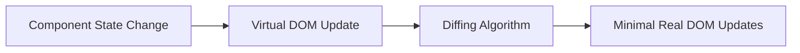
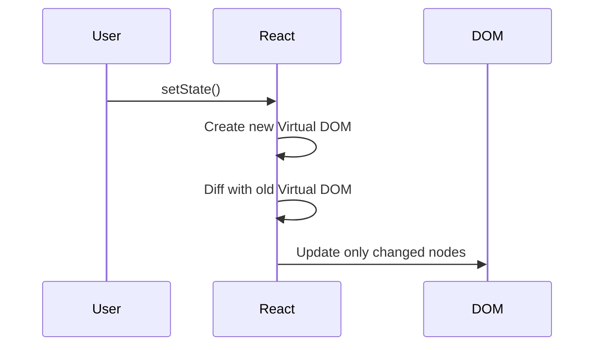
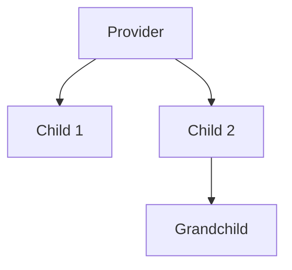

# Problem 5: Simple State Management System

## Problem Description

Implement a simple state management system similar to Redux but lightweight.

## Requirements

- Centralized state store
- Action dispatching
- Reducer pattern
- State subscriptions
- Middleware support

## Solution

```javascript
class SimpleStore {
  constructor(reducer, initialState = {}) {
    this.reducer = reducer;
    this.state = initialState;
    this.subscribers = new Set();
    this.middlewares = [];

    this.dispatch = this.dispatch.bind(this);
  }

  getState() {
    return this.state;
  }

  dispatch(action) {
    if (typeof action === "function") {
      return action(this.dispatch, this.getState);
    }

    // Apply middlewares
    let processedAction = action;
    for (const middleware of this.middlewares) {
      processedAction = middleware(this)(processedAction);
      if (!processedAction) return;
    }

    // Update state
    const previousState = this.state;
    this.state = this.reducer(this.state, processedAction);

    // Notify subscribers
    this.subscribers.forEach((subscriber) => {
      subscriber(this.state, previousState, processedAction);
    });

    return processedAction;
  }

  subscribe(subscriber) {
    this.subscribers.add(subscriber);
    return () => {
      this.subscribers.delete(subscriber);
    };
  }

  useMiddleware(middleware) {
    this.middlewares.push(middleware);
  }
}

// Example reducer
const todoReducer = (state = { todos: [], filter: "all" }, action) => {
  switch (action.type) {
    case "ADD_TODO":
      return {
        ...state,
        todos: [
          ...state.todos,
          {
            id: Date.now(),
            text: action.payload,
            completed: false,
          },
        ],
      };

    case "TOGGLE_TODO":
      return {
        ...state,
        todos: state.todos.map((todo) =>
          todo.id === action.payload
            ? { ...todo, completed: !todo.completed }
            : todo
        ),
      };

    case "DELETE_TODO":
      return {
        ...state,
        todos: state.todos.filter((todo) => todo.id !== action.payload),
      };

    case "SET_FILTER":
      return {
        ...state,
        filter: action.payload,
      };

    default:
      return state;
  }
};

// Action creators
const addTodo = (text) => ({
  type: "ADD_TODO",
  payload: text,
});

const toggleTodo = (id) => ({
  type: "TOGGLE_TODO",
  payload: id,
});

const deleteTodo = (id) => ({
  type: "DELETE_TODO",
  payload: id,
});

const setFilter = (filter) => ({
  type: "SET_FILTER",
  payload: filter,
});

// Middleware examples
const loggerMiddleware = (store) => (action) => {
  console.log("Previous State:", store.getState());
  console.log("Action:", action);
  const result = action;
  console.log("Next State:", store.getState());
  return result;
};

const thunkMiddleware = (store) => (action) => {
  if (typeof action === "function") {
    return action(store.dispatch, store.getState);
  }
  return action;
};

// Usage
const store = new SimpleStore(todoReducer, {
  todos: [],
  filter: "all",
});

store.useMiddleware(loggerMiddleware);
store.useMiddleware(thunkMiddleware);

const unsubscribe = store.subscribe((state, previousState, action) => {
  console.log("State changed:", action.type);
  renderApp(state);
});

// Dispatch actions
store.dispatch(addTodo("Learn Redux"));
store.dispatch(addTodo("Build an app"));
store.dispatch(toggleTodo(1));
```

## React Integration

```javascript
import { useState, useEffect } from "react";

const useStore = (store, selector) => {
  const [state, setState] = useState(selector(store.getState()));

  useEffect(() => {
    const unsubscribe = store.subscribe((newState) => {
      const newSelectedState = selector(newState);
      setState(newSelectedState);
    });

    return unsubscribe;
  }, [store, selector]);

  return [state, store.dispatch];
};

const TodoApp = ({ store }) => {
  const [state, dispatch] = useStore(store, (state) => state);
  const [inputValue, setInputValue] = useState("");

  const handleAddTodo = (e) => {
    e.preventDefault();
    if (inputValue.trim()) {
      dispatch(addTodo(inputValue.trim()));
      setInputValue("");
    }
  };

  const filteredTodos = state.todos.filter((todo) => {
    if (state.filter === "active") return !todo.completed;
    if (state.filter === "completed") return todo.completed;
    return true;
  });

  return (
    <div className="todo-app">
      <h1>Todo App</h1>

      <form onSubmit={handleAddTodo}>
        <input
          type="text"
          value={inputValue}
          onChange={(e) => setInputValue(e.target.value)}
          placeholder="Add a new todo..."
        />
        <button type="submit">Add</button>
      </form>

      <div className="filters">
        <button
          className={state.filter === "all" ? "active" : ""}
          onClick={() => dispatch(setFilter("all"))}
        >
          All
        </button>
        <button
          className={state.filter === "active" ? "active" : ""}
          onClick={() => dispatch(setFilter("active"))}
        >
          Active
        </button>
        <button
          className={state.filter === "completed" ? "active" : ""}
          onClick={() => dispatch(setFilter("completed"))}
        >
          Completed
        </button>
      </div>

      <ul className="todo-list">
        {filteredTodos.map((todo) => (
          <li key={todo.id} className={todo.completed ? "completed" : ""}>
            <input
              type="checkbox"
              checked={todo.completed}
              onChange={() => dispatch(toggleTodo(todo.id))}
            />
            <span>{todo.text}</span>
            <button onClick={() => dispatch(deleteTodo(todo.id))}>
              Delete
            </button>
          </li>
        ))}
      </ul>
    </div>
  );
};
```

## CSS Styling

```css
.todo-app {
  max-width: 600px;
  margin: 0 auto;
  padding: 20px;
  font-family: Arial, sans-serif;
}

.todo-app h1 {
  text-align: center;
  color: #333;
  margin-bottom: 30px;
}

.todo-app form {
  display: flex;
  gap: 10px;
  margin-bottom: 20px;
}

.todo-app input[type="text"] {
  flex: 1;
  padding: 12px;
  border: 2px solid #ddd;
  border-radius: 6px;
  font-size: 16px;
}

.todo-app button {
  padding: 12px 20px;
  background: #007bff;
  color: white;
  border: none;
  border-radius: 6px;
  cursor: pointer;
  font-size: 16px;
  transition: background-color 0.3s;
}

.todo-app button:hover {
  background: #0056b3;
}

.filters {
  display: flex;
  gap: 10px;
  margin-bottom: 20px;
}

.filters button {
  padding: 8px 16px;
  background: white;
  color: #333;
  border: 1px solid #ddd;
}

.filters button.active {
  background: #007bff;
  color: white;
  border-color: #007bff;
}

.todo-list {
  list-style: none;
  padding: 0;
}

.todo-list li {
  display: flex;
  align-items: center;
  gap: 10px;
  padding: 12px;
  border-bottom: 1px solid #eee;
  background: white;
}

.todo-list li.completed span {
  text-decoration: line-through;
  color: #888;
}

.todo-list button {
  padding: 6px 12px;
  background: #dc3545;
  font-size: 14px;
}

.todo-list button:hover {
  background: #c82333;
}
```

## Key Features

1. **Centralized State**: Single source of truth
2. **Predictable Updates**: State changes through actions
3. **Middleware Support**: Extensible with custom middleware
4. **React Integration**: Custom hook for React
5. **Subscription System**: Efficient state change notifications
6. **Action Creators**: Reusable action functions
7. **Immutable Updates**: Always return new state objects
8. **Debugging**: Built-in logging middleware

---

# React Interview Deep Dive: Questions, Diagrams, and Explanations

## 1. What is the Virtual DOM and how does React use it?

**Answer:**

- The Virtual DOM is a lightweight JS representation of the real DOM.
- React updates the Virtual DOM first, then efficiently updates the real DOM using a diffing algorithm (reconciliation).

**Diagram:**



---

## 2. Explain React's Reconciliation Process

**Answer:**

- When state/props change, React creates a new Virtual DOM tree.
- It compares (diffs) the new tree with the previous one.
- Only the changed nodes are updated in the real DOM.

**Diagram:**



---

## 3. What are React Hooks? Name and explain the most common ones.

**Answer:**

- Hooks let you use state and lifecycle features in function components.
- Common hooks:
  - `useState`: Local state
  - `useEffect`: Side effects (data fetching, subscriptions)
  - `useContext`: Access context
  - `useReducer`: Complex state logic
  - `useRef`: Mutable refs, DOM access
  - `useMemo`/`useCallback`: Memoization

---

## 4. How does Context API work? When should you use it?

**Answer:**

- Context provides a way to pass data through the component tree without props drilling.
- Use for global data (theme, user, locale) but avoid for high-frequency updates (use state management instead).

**Diagram:**



---

## 5. What is a Higher-Order Component (HOC)?

**Answer:**

- A function that takes a component and returns a new component with enhanced behavior.
- Used for code reuse (e.g., authentication, logging, theming).

**Example:**

```js
function withLogger(WrappedComponent) {
  return function (props) {
    useEffect(() => {
      console.log("Mounted");
    }, []);
    return <WrappedComponent {...props} />;
  };
}
```

---

## 6. Explain React's key prop and why it's important.

**Answer:**

- The `key` prop helps React identify which items have changed, are added, or are removed in a list.
- Keys should be unique and stable (not array index).

---

## 7. What is code splitting and how do you implement it in React?

**Answer:**

- Code splitting breaks your app into smaller bundles for faster load times.
- Use `React.lazy` and `Suspense` for dynamic imports.

**Example:**

```js
const LazyComponent = React.lazy(() => import("./LazyComponent"));
```

---

## 8. How do you optimize performance in React apps?

**Answer:**

- Use memoization (`React.memo`, `useMemo`, `useCallback`)
- Avoid unnecessary re-renders
- Use virtualization for large lists
- Code splitting and lazy loading
- Minimize state in high-frequency components

---

## 9. What is an Error Boundary? How do you use it?

**Answer:**

- A React component that catches JS errors in its child tree and displays a fallback UI.
- Implement with a class component using `componentDidCatch` and `getDerivedStateFromError`.

---

## 10. How does React handle events? How is it different from the DOM?

**Answer:**

- React uses a synthetic event system for cross-browser compatibility.
- Events are wrapped and pooled for performance.
- Event handlers are camelCase (`onClick`), not lowercase (`onclick`).

---

## 11. What is the difference between controlled and uncontrolled components?

**Answer:**

- Controlled: Form data managed by React state.
- Uncontrolled: Form data managed by the DOM (useRef).

---

## 12. How do you test React components?

**Answer:**

- Use Jest and React Testing Library.
- Test rendering, user interactions, and output.
- Mock APIs and context as needed.

---

## 13. How do you handle side effects in React?

**Answer:**

- Use `useEffect` for data fetching, subscriptions, manual DOM changes.
- Clean up effects to avoid memory leaks.

---

## 14. What is prop drilling and how do you avoid it?

**Answer:**

- Prop drilling: Passing props through many layers.
- Avoid with Context API or state management libraries.

---

## 15. Explain React's rendering lifecycle (function and class components).

**Answer:**

- Function: Render -> commit -> effects (`useEffect` runs after paint)
- Class: constructor -> render -> componentDidMount -> updates -> componentWillUnmount

---

_Use these questions, diagrams, and explanations to prepare for all levels of React interviews. Practice drawing diagrams and explaining concepts out loud!_
