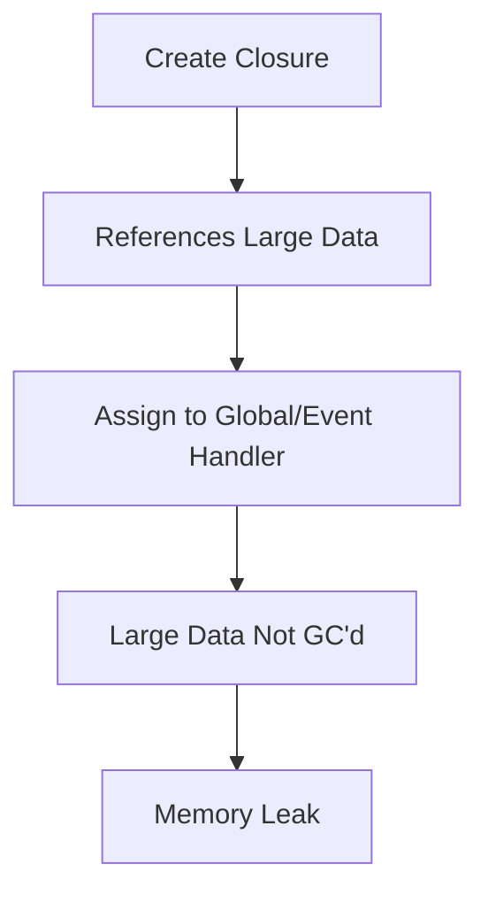

# JavaScript Closures & Scope: Complete Deep Dive

## Table of Contents

- [Understanding Scope](#understanding-scope)
- [Lexical Scoping](#lexical-scoping)
- [What are Closures?](#what-are-closures)
- [How Closures Work](#how-closures-work)
- [Closure Use Cases](#closure-use-cases)
- [Memory Management](#memory-management)
- [Visual Diagrams](#visual-diagrams)
- [Common Patterns](#common-patterns)
- [Performance Considerations](#performance-considerations)
- [Interview Questions & Answers](#interview-questions--answers)
- [Advanced Examples](#advanced-examples)

## Understanding Scope

### What is Scope?

**Scope** determines the accessibility of variables, functions, and objects in different parts of your code. It defines the **context** in which variables exist and can be accessed.

#### Types of Scope in JavaScript:

**1. Global Scope**

- Variables accessible from anywhere in the program
- Properties of the global object (window in browsers)

**2. Function Scope**

- Variables accessible only within the function
- Created when function is invoked

**3. Block Scope** (ES6+)

- Variables accessible only within the block {}
- Applies to `let` and `const` declarations

**4. Module Scope** (ES6+)

- Variables accessible only within the module
- Top-level scope of a module

### Scope Chain

JavaScript uses a **scope chain** to resolve variable access:

```
┌─────────────────────────────────────────┐
│            SCOPE CHAIN                  │
│                                         │
│  Inner Scope                            │
│  ┌─────────────────────────────────┐    │
│  │  Look for variable here first  │    │
│  │  ↓ Not found? Go up the chain  │    │
│  └─────────────────────────────────┘    │
│                │                        │
│  Outer Scope   ↓                        │
│  ┌─────────────────────────────────┐    │
│  │  Look for variable here        │    │
│  │  ↓ Not found? Continue up      │    │
│  └─────────────────────────────────┘    │
│                │                        │
│  Global Scope  ↓                        │
│  ┌─────────────────────────────────┐    │
│  │  Look for variable here        │    │
│  │  ↓ Not found? ReferenceError   │    │
│  └─────────────────────────────────┘    │
└─────────────────────────────────────────┘
```

### Detailed Scope Example

```javascript
// Global Scope
const globalVar = "I am global";

function outerFunction() {
  // Outer Function Scope
  const outerVar = "I am outer";

  function innerFunction() {
    // Inner Function Scope
    const innerVar = "I am inner";

    console.log(innerVar); // ✅ Accessible - same scope
    console.log(outerVar); // ✅ Accessible - outer scope
    console.log(globalVar); // ✅ Accessible - global scope
  }

  innerFunction();
  console.log(innerVar); // ❌ ReferenceError - not in scope
}

outerFunction();
```

**Scope Chain Resolution:**

```
innerFunction scope: { innerVar }
        ↓ (if not found)
outerFunction scope: { outerVar }
        ↓ (if not found)
Global scope: { globalVar }
        ↓ (if not found)
ReferenceError: variable is not defined
```

## Lexical Scoping

### What is Lexical Scoping?

**Lexical Scoping** means that the scope of variables is determined by where they are declared in the code, not where they are called from.

#### Key Principles:

**1. Static Scope**

- Scope is determined at **compile time**
- Based on **where** variables and functions are declared
- **Not** where they are called

**2. Nested Function Access**

- Inner functions have access to outer function variables
- Outer functions **cannot** access inner function variables

### Lexical Scoping Example

```javascript
const name = "Global John";

function createGreeting() {
  const name = "Function John";

  return function greet() {
    console.log(`Hello, ${name}!`);
  };
}

const greeting = createGreeting();
greeting(); // "Hello, Function John!"

// Even though we call greeting() in global scope,
// it still uses the 'name' from where it was defined
```

**Visual Representation:**

```
┌─────────────────────────────────────────┐
│         LEXICAL ENVIRONMENT            │
│                                         │
│  Global: { name: 'Global John' }        │
│  │                                      │
│  └─ createGreeting(): {                 │
│       name: 'Function John',            │
│       greet: function() {...}           │
│     }                                   │
│                                         │
│  greet() function "remembers"           │
│  the scope where it was created         │
└─────────────────────────────────────────┘
```

## What are Closures?

### Definition

A **Closure** is a feature where an inner function has access to variables from its outer (enclosing) scope even after the outer function has finished executing.

#### Three Key Characteristics:

**1. Access to Outer Variables**

- Inner function can access outer function's variables

**2. Persistent Scope**

- Outer function's variables remain accessible even after it returns

**3. Data Privacy**

- Variables in the closure are private to that specific instance

### Simple Closure Example

```javascript
function outerFunction(x) {
  // This variable is "captured" by the closure
  const outerVariable = x;

  function innerFunction(y) {
    console.log(outerVariable + y);
  }

  return innerFunction;
}

const myClosure = outerFunction(10);
myClosure(5); // Outputs: 15

// outerFunction has finished executing,
// but innerFunction still has access to outerVariable
```

### Closure Creation Process

```
Step 1: outerFunction(10) is called
┌─────────────────────────────────────┐
│ outerFunction Execution Context     │
│ Variables: { x: 10, outerVariable: 10 } │
│ Functions: { innerFunction }        │
└─────────────────────────────────────┘

Step 2: innerFunction is created and returned
┌─────────────────────────────────────┐
│ Closure Created                     │
│ Contains: { outerVariable: 10 }     │
│ Function: innerFunction             │
└─────────────────────────────────────┘

Step 3: outerFunction execution context is destroyed
But the closure preserves outerVariable!

Step 4: myClosure(5) is called
┌─────────────────────────────────────┐
│ innerFunction Execution Context     │
│ Has access to: { y: 5 }            │
│ Plus closure: { outerVariable: 10 } │
│ Result: 10 + 5 = 15                 │
└─────────────────────────────────────┘
```

## How Closures Work

### Behind the Scenes: Lexical Environment

Every function in JavaScript maintains a reference to its **Lexical Environment**:

```javascript
function makeCounter() {
  let count = 0; // This is in the Lexical Environment

  return function () {
    count++; // Accesses the captured variable
    return count;
  };
}

const counter1 = makeCounter();
const counter2 = makeCounter();

console.log(counter1()); // 1
console.log(counter1()); // 2
console.log(counter2()); // 1 (independent closure)
console.log(counter1()); // 3
```

**Memory Structure:**

```
┌─────────────────────────────────────────┐
│           MEMORY HEAP                   │
│                                         │
│  counter1 Closure:                      │
│  ┌─────────────────────────────────┐    │
│  │ Lexical Environment:            │    │
│  │ { count: 3 }                    │    │
│  │ Function: [anonymous function]  │    │
│  └─────────────────────────────────┘    │
│                                         │
│  counter2 Closure:                      │
│  ┌─────────────────────────────────┐    │
│  │ Lexical Environment:            │    │
│  │ { count: 1 }                    │    │
│  │ Function: [anonymous function]  │    │
│  └─────────────────────────────────┘    │
└─────────────────────────────────────────┘
```

### Variable Capture vs Reference

**Important**: Closures capture variables by **reference**, not by value:

```javascript
function createFunctions() {
  const functions = [];

  // Common mistake
  for (var i = 0; i < 3; i++) {
    functions.push(function () {
      console.log(i); // Captures reference to 'i'
    });
  }

  return functions;
}

const funcs = createFunctions();
funcs[0](); // 3 (not 0!)
funcs[1](); // 3 (not 1!)
funcs[2](); // 3 (not 2!)
```

**Why this happens:**

```
All three functions share the same lexical environment
that contains the variable 'i'.

When the loop finishes, i = 3.
All functions reference the same 'i' variable.
```

**Solutions:**

**1. Use `let` (block scope):**

```javascript
function createFunctions() {
  const functions = [];

  for (let i = 0; i < 3; i++) {
    // 'let' creates new scope each iteration
    functions.push(function () {
      console.log(i);
    });
  }

  return functions;
}

const funcs = createFunctions();
funcs[0](); // 0
funcs[1](); // 1
funcs[2](); // 2
```

**2. Use IIFE (Immediately Invoked Function Expression):**

```javascript
function createFunctions() {
  const functions = [];

  for (var i = 0; i < 3; i++) {
    functions.push(
      (function (index) {
        return function () {
          console.log(index);
        };
      })(i)
    ); // IIFE creates new scope with 'index'
  }

  return functions;
}
```

## Closure Use Cases

### 1. Module Pattern

Create private variables and methods:

```javascript
const Calculator = (function () {
  // Private variables
  let history = [];
  let currentValue = 0;

  // Private methods
  function addToHistory(operation, value) {
    history.push(`${operation}: ${value}`);
  }

  function validateNumber(num) {
    if (typeof num !== "number" || isNaN(num)) {
      throw new Error("Invalid number");
    }
  }

  // Public API
  return {
    add(num) {
      validateNumber(num);
      currentValue += num;
      addToHistory("ADD", num);
      return this; // Method chaining
    },

    subtract(num) {
      validateNumber(num);
      currentValue -= num;
      addToHistory("SUBTRACT", num);
      return this;
    },

    getValue() {
      return currentValue;
    },

    getHistory() {
      return [...history]; // Return copy, not reference
    },

    clear() {
      currentValue = 0;
      history = [];
      return this;
    },
  };
})();

// Usage
Calculator.add(10).subtract(3).add(5);

console.log(Calculator.getValue()); // 12
console.log(Calculator.getHistory()); // ['ADD: 10', 'SUBTRACT: 3', 'ADD: 5']

// Private variables are not accessible
console.log(Calculator.history); // undefined
```

### 2. Factory Functions

Create objects with private state:

```javascript
function createBankAccount(initialBalance = 0) {
  let balance = initialBalance;
  let transactionHistory = [];

  function recordTransaction(type, amount) {
    transactionHistory.push({
      type,
      amount,
      timestamp: new Date(),
      balanceAfter: balance,
    });
  }

  return {
    deposit(amount) {
      if (amount <= 0) {
        throw new Error("Deposit amount must be positive");
      }
      balance += amount;
      recordTransaction("DEPOSIT", amount);
      return balance;
    },

    withdraw(amount) {
      if (amount <= 0) {
        throw new Error("Withdrawal amount must be positive");
      }
      if (amount > balance) {
        throw new Error("Insufficient funds");
      }
      balance -= amount;
      recordTransaction("WITHDRAWAL", amount);
      return balance;
    },

    getBalance() {
      return balance;
    },

    getTransactionHistory() {
      return transactionHistory.map((t) => ({ ...t })); // Deep copy
    },
  };
}

const account1 = createBankAccount(100);
const account2 = createBankAccount(50);

account1.deposit(25);
account2.withdraw(10);

console.log(account1.getBalance()); // 125
console.log(account2.getBalance()); // 40

// Each account has its own private state
console.log(account1.balance); // undefined (private)
```

### 3. Event Handlers with State

Maintain state in event handlers:

```javascript
function createButtonWithCounter(buttonId) {
  let clickCount = 0;
  let lastClickTime = null;

  const button = document.getElementById(buttonId);

  button.addEventListener("click", function (event) {
    clickCount++;
    const now = Date.now();
    const timeSinceLastClick = lastClickTime ? now - lastClickTime : 0;

    console.log(`Button clicked ${clickCount} times`);

    if (timeSinceLastClick > 0) {
      console.log(`Time since last click: ${timeSinceLastClick}ms`);
    }

    lastClickTime = now;

    // Update button text with click count
    button.textContent = `Clicked ${clickCount} times`;
  });

  return {
    getClickCount: () => clickCount,
    reset: () => {
      clickCount = 0;
      lastClickTime = null;
      button.textContent = "Click me";
    },
  };
}

const buttonCounter = createButtonWithCounter("myButton");
```

### 4. Memoization (Caching)

Cache expensive function results:

```javascript
function memoize(fn) {
  const cache = new Map();

  return function (...args) {
    const key = JSON.stringify(args);

    if (cache.has(key)) {
      console.log("Cache hit!");
      return cache.get(key);
    }

    console.log("Computing result...");
    const result = fn.apply(this, args);
    cache.set(key, result);
    return result;
  };
}

// Expensive function
function fibonacci(n) {
  if (n <= 1) return n;
  return fibonacci(n - 1) + fibonacci(n - 2);
}

const memoizedFibonacci = memoize(fibonacci);

console.log(memoizedFibonacci(10)); // Computing result... 55
console.log(memoizedFibonacci(10)); // Cache hit! 55
console.log(memoizedFibonacci(11)); // Computing result... 89
```

### 5. Partial Application & Currying

Create specialized functions:

```javascript
// Partial Application
function multiply(a, b, c) {
  return a * b * c;
}

function partial(fn, ...fixedArgs) {
  return function (...remainingArgs) {
    return fn(...fixedArgs, ...remainingArgs);
  };
}

const multiplyByTwo = partial(multiply, 2);
const multiplyByTwoAndThree = partial(multiply, 2, 3);

console.log(multiplyByTwo(3, 4)); // 2 * 3 * 4 = 24
console.log(multiplyByTwoAndThree(5)); // 2 * 3 * 5 = 30

// Currying
function curry(fn) {
  return function curried(...args) {
    if (args.length >= fn.length) {
      return fn.apply(this, args);
    } else {
      return function (...nextArgs) {
        return curried.apply(this, args.concat(nextArgs));
      };
    }
  };
}

const curriedMultiply = curry(multiply);

console.log(curriedMultiply(2)(3)(4)); // 24
console.log(curriedMultiply(2, 3)(4)); // 24
console.log(curriedMultiply(2)(3, 4)); // 24
```

## Memory Management

### Closure Memory Considerations

Closures can lead to memory leaks if not handled properly:

**Problem: Accidental Object Retention**

```javascript
function attachListeners() {
  const largeObject = new Array(1000000).fill("data");

  document.getElementById("button").addEventListener("click", function () {
    // This closure keeps largeObject in memory
    console.log("Button clicked");
  });
}

attachListeners();
// largeObject remains in memory even though it's not used!
```

**Solution: Explicit Cleanup**

```javascript
function attachListeners() {
  const largeObject = new Array(1000000).fill("data");

  function clickHandler() {
    console.log("Button clicked");
    // Don't reference largeObject here
  }

  document.getElementById("button").addEventListener("click", clickHandler);

  // Cleanup function
  return function cleanup() {
    document
      .getElementById("button")
      .removeEventListener("click", clickHandler);
    // largeObject will be garbage collected
  };
}

const cleanup = attachListeners();
// Later...
cleanup();
```

### Memory Leak Prevention

**1. Avoid Unnecessary Variable Capture**

```javascript
// BAD: Captures unnecessary variables
function createHandler(data) {
  const largeArray = new Array(1000000);
  const someOtherStuff = {
    /* ... */
  };

  return function () {
    console.log(data); // Only needs 'data', but captures everything
  };
}

// GOOD: Only capture what you need
function createHandler(data) {
  const largeArray = new Array(1000000);
  const someOtherStuff = {
    /* ... */
  };

  // Extract only what you need
  const neededData = data;

  return function () {
    console.log(neededData);
  };
}
```

**2. Break Circular References**

```javascript
function setupComponent() {
  const element = document.getElementById("component");

  element.onclick = function () {
    // Circular reference: element -> function -> element
    element.style.color = "red";
  };

  // Break the cycle
  return function cleanup() {
    element.onclick = null;
  };
}
```

## Visual Diagrams

### Closure Memory Structure

```
┌─────────────────────────────────────────────────────────────┐
│                    JAVASCRIPT MEMORY                        │
│                                                             │
│  ┌─────────────────────────────────────────────────────┐    │
│  │                  CALL STACK                         │    │
│  │                                                     │    │
│  │  ┌─────────────────────────────────────────────┐    │    │
│  │  │        Global Execution Context             │    │    │
│  │  │                                             │    │    │
│  │  │  Variables: { counter: [Function] }         │    │    │
│  │  └─────────────────────────────────────────────┘    │    │
│  └─────────────────────────────────────────────────────┘    │
│                                                             │
│  ┌─────────────────────────────────────────────────────┐    │
│  │                    HEAP MEMORY                      │    │
│  │                                                     │    │
│  │  ┌─────────────────────────────────────────────┐    │    │
│  │  │           Closure Object                    │    │    │
│  │  │                                             │    │    │
│  │  │  Lexical Environment:                       │    │    │
│  │  │  ┌─────────────────────────────────────┐    │    │    │
│  │  │  │  Variables: { count: 0 }            │    │    │    │
│  │  │  └─────────────────────────────────────┘    │    │    │
│  │  │                                             │    │    │
│  │  │  Function Code:                             │    │    │
│  │  │  ┌─────────────────────────────────────┐    │    │    │
│  │  │  │  function() {                       │    │    │    │
│  │  │  │    count++;                         │    │    │    │
│  │  │  │    return count;                    │    │    │    │
│  │  │  │  }                                  │    │    │    │
│  │  │  └─────────────────────────────────────┘    │    │    │
│  │  └─────────────────────────────────────────────┘    │    │
│  └─────────────────────────────────────────────────────┘    │
│                                                             │
│  ┌─────────────────────────────────────────────────────┐    │
│  │               REFERENCE CHAIN                       │    │
│  │                                                     │    │
│  │  counter variable ──────────→ Closure Object        │    │
│  │                                    │                │    │
│  │                                    ▼                │    │
│  │                           Lexical Environment       │    │
│  │                                    │                │    │
│  │                                    ▼                │    │
│  │                              { count: 0 }           │    │
│  └─────────────────────────────────────────────────────┘    │
└─────────────────────────────────────────────────────────────┘
```

### Scope Chain Resolution

```
Function Call: innerFunction()

Step 1: Look in Local Scope
┌─────────────────────────────────┐
│   innerFunction Scope           │
│                                 │
│   Looking for: variableName     │
│   Found: [ ] Yes [ ] No         │
│                                 │
└─────────────────────────────────┘
                │
                ▼ (if not found)
Step 2: Look in Outer Function Scope
┌─────────────────────────────────┐
│   outerFunction Scope           │
│                                 │
│   Looking for: variableName     │
│   Found: [ ] Yes [ ] No         │
│                                 │
└─────────────────────────────────┘
                │
                ▼ (if not found)
Step 3: Look in Global Scope
┌─────────────────────────────────┐
│   Global Scope                  │
│                                 │
│   Looking for: variableName     │
│   Found: [ ] Yes [ ] No         │
│                                 │
└─────────────────────────────────┘
                │
                ▼ (if not found)
        ReferenceError!
```

## Performance Considerations

### Closure Performance Impact

**1. Memory Usage**

```javascript
// Each closure instance maintains its own scope
function createCounter() {
  let count = 0;
  const largeArray = new Array(1000000); // Each instance has this!

  return function () {
    return ++count;
  };
}

// Creates 1000 closures, each with its own largeArray
const counters = Array.from({ length: 1000 }, createCounter);
```

**2. Garbage Collection**

```javascript
// Closure prevents garbage collection
let globalRef;

function createClosure() {
  const largeData = new Array(1000000).fill("data");

  globalRef = function () {
    return largeData.length; // Keeps largeData alive
  };
}

createClosure();
// largeData cannot be garbage collected while globalRef exists
```

**3. Performance Optimization**

**Bad: Recreating closures in render**

```javascript
function MyComponent({ items }) {
  return items.map((item) => (
    <button
      key={item.id}
      onClick={() => handleClick(item.id)} // New closure each render!
    >
      {item.name}
    </button>
  ));
}
```

**Good: Memoized or stable references**

```javascript
function MyComponent({ items }) {
  const handleClick = useCallback((id) => {
    // Handle click
  }, []);

  return items.map((item) => (
    <button key={item.id} onClick={() => handleClick(item.id)}>
      {item.name}
    </button>
  ));
}
```

## Interview Questions & Answers

### Q1: What will this code output and why?

```javascript
for (var i = 0; i < 3; i++) {
  setTimeout(function () {
    console.log(i);
  }, 100);
}
```

**Answer**: It will output `3` three times.

**Explanation**:

- The `setTimeout` callbacks are executed after the loop completes
- All three closures capture a reference to the same variable `i`
- When the callbacks execute, `i` has the value 3 (the final value after the loop)

**Solutions**:

```javascript
// Solution 1: Use let (block scope)
for (let i = 0; i < 3; i++) {
  setTimeout(function () {
    console.log(i); // 0, 1, 2
  }, 100);
}

// Solution 2: IIFE
for (var i = 0; i < 3; i++) {
  (function (j) {
    setTimeout(function () {
      console.log(j); // 0, 1, 2
    }, 100);
  })(i);
}

// Solution 3: bind
for (var i = 0; i < 3; i++) {
  setTimeout(
    function (j) {
      console.log(j); // 0, 1, 2
    }.bind(null, i),
    100
  );
}
```

### Q2: Explain how this module pattern works:

```javascript
const Module = (function () {
  let privateVar = 0;

  function privateFunction() {
    console.log("Private function called");
  }

  return {
    publicMethod() {
      privateVar++;
      privateFunction();
      return privateVar;
    },

    getPrivateVar() {
      return privateVar;
    },
  };
})();
```

**Answer**:
This is the **Module Pattern** using an IIFE (Immediately Invoked Function Expression):

1. **IIFE**: Creates a private scope immediately
2. **Private variables**: `privateVar` and `privateFunction` are enclosed in the function scope
3. **Public API**: The returned object exposes only the methods we want to be public
4. **Closure**: The returned methods maintain access to the private variables
5. **Encapsulation**: Private variables cannot be accessed directly from outside

**Usage**:

```javascript
console.log(Module.publicMethod()); // 1
console.log(Module.getPrivateVar()); // 1
console.log(Module.privateVar); // undefined (private)
```

### Q3: What's the difference between these two approaches?

```javascript
// Approach 1
function createMultiplier(x) {
  return function (y) {
    return x * y;
  };
}

// Approach 2
function multiply(x, y) {
  return x * y;
}
```

**Answer**:

**Approach 1 (Closure)**:

- Creates a **specialized function** with `x` "baked in"
- Each call to `createMultiplier` creates a new closure
- Useful for **partial application** and **function specialization**
- More memory usage (maintains closure scope)

```javascript
const double = createMultiplier(2);
const triple = createMultiplier(3);

console.log(double(5)); // 10
console.log(triple(5)); // 15
```

**Approach 2 (Regular function)**:

- Direct multiplication without closure
- More **memory efficient**
- Requires both parameters each time
- No function specialization

```javascript
console.log(multiply(2, 5)); // 10
console.log(multiply(3, 5)); // 15
```

### Q4: How do you create private methods in JavaScript?

**Answer**:

**1. Module Pattern with IIFE**:

```javascript
const MyModule = (function () {
  // Private variables and methods
  let privateCounter = 0;

  function privateMethod() {
    console.log("This is private");
  }

  function incrementCounter() {
    privateCounter++;
    privateMethod();
  }

  // Public API
  return {
    increment: incrementCounter,
    getCount() {
      return privateCounter;
    },
  };
})();
```

**2. Factory Function**:

```javascript
function createObject() {
  let privateVar = "secret";

  function privateMethod() {
    return `Accessing ${privateVar}`;
  }

  return {
    publicMethod() {
      return privateMethod();
    },
  };
}
```

**3. WeakMap Pattern**:

```javascript
const privateData = new WeakMap();

class MyClass {
  constructor() {
    privateData.set(this, {
      secret: "private value",
      privateMethod() {
        return "This is private";
      },
    });
  }

  publicMethod() {
    const data = privateData.get(this);
    return data.privateMethod();
  }
}
```

**4. Private Fields (ES2022)**:

```javascript
class MyClass {
  #privateField = "secret";

  #privateMethod() {
    return "This is private";
  }

  publicMethod() {
    return this.#privateMethod();
  }
}
```

### Q5: Explain memory leaks with closures and how to prevent them.

**Answer**:

**Common Memory Leak Scenarios**:

**1. Event Listeners with Closures**:

```javascript
// PROBLEM: Memory leak
function setupComponent() {
  const largeData = new Array(1000000);

  document.getElementById("button").onclick = function () {
    console.log("Clicked"); // Keeps largeData in memory
  };
}

// SOLUTION: Explicit cleanup
function setupComponent() {
  const largeData = new Array(1000000);

  function clickHandler() {
    console.log("Clicked");
    // Don't reference largeData
  }

  const button = document.getElementById("button");
  button.onclick = clickHandler;

  return function cleanup() {
    button.onclick = null;
    // Now largeData can be garbage collected
  };
}
```

**2. Circular References**:

```javascript
// PROBLEM: Circular reference
function createNode() {
  const node = {
    parent: null,
    children: [],
    cleanup: function () {
      // This creates a circular reference
      this.parent = null;
      this.children = [];
    },
  };

  return node;
}

// SOLUTION: WeakMap or explicit cleanup
const nodeCleanup = new WeakMap();

function createNode() {
  const node = {
    parent: null,
    children: [],
  };

  nodeCleanup.set(node, function () {
    node.parent = null;
    node.children = [];
  });

  return node;
}
```

**Prevention Strategies**:

1. **Remove event listeners** when no longer needed
2. **Avoid capturing unnecessary variables** in closures
3. **Use WeakMap** for private data
4. **Set references to null** when done
5. **Use tools** like Chrome DevTools Memory tab to detect leaks

This comprehensive guide covers closures and scope from fundamental concepts to advanced patterns, providing the deep understanding needed for senior frontend engineering interviews.

# Additional Advanced Interview Q&A and Visuals

## Q: How can closures cause memory leaks in JavaScript applications?

**Answer (English):**

- Closures keep references to variables in their scope chain
- If a closure references large data or DOM nodes, and is attached to a global or long-lived object (e.g., event handler), the data cannot be garbage collected
- Always clean up event handlers and avoid unnecessary references in closures

**Answer (Vietnamese):**

- Closure giữ tham chiếu tới biến trong scope chain
- Nếu closure tham chiếu dữ liệu lớn hoặc DOM node, và được gán cho global hoặc object sống lâu (ví dụ event handler), dữ liệu sẽ không được giải phóng bộ nhớ
- Luôn cleanup event handler và tránh giữ tham chiếu không cần thiết trong closure

---

## Diagram: Closure Memory Leak



---

## Q: How would you use closures to implement a private counter with increment and reset methods?

**Answer (English):**

- Use a factory function that returns an object with methods
- The counter variable is private in the closure

```javascript
function createCounter() {
  let count = 0;
  return {
    increment() {
      return ++count;
    },
    reset() {
      count = 0;
      return count;
    },
  };
}
const counter = createCounter();
counter.increment(); // 1
counter.reset(); // 0
```

**Answer (Vietnamese):**

- Dùng factory function trả về object chứa các method
- Biến counter là private trong closure

---
