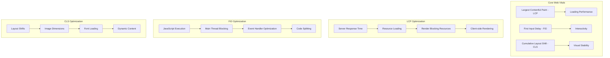

# Core Web Vitals Deep Dive - Performance Optimization Mastery

## 📊 Core Web Vitals Theory

### **What are Core Web Vitals?**
**Definition:** Core Web Vitals are a set of real-world, user-centered metrics that quantify key aspects of user experience. They measure loading performance, interactivity, and visual stability of web pages.

**Why Core Web Vitals Matter:**
- **SEO Impact**: Google uses them as ranking factors
- **User Experience**: Directly correlate with user satisfaction
- **Business Metrics**: Affect conversion rates and revenue
- **Performance Standards**: Provide objective performance targets

**The Three Core Web Vitals:**



**Deep Theory with Advanced Examples:**
```javascript
// WHAT: Core Web Vitals measurement and optimization
class CoreWebVitalsAnalyzer {
    constructor() {
        this.metrics = new Map();
        this.observers = new Map();
        this.thresholds = {
            LCP: { good: 2500, poor: 4000 },
            FID: { good: 100, poor: 300 },
            CLS: { good: 0.1, poor: 0.25 }
        };
    }
    
    // Measure Largest Contentful Paint (LCP)
    measureLCP() {
        if (!('PerformanceObserver' in window)) return;
        
        const observer = new PerformanceObserver((entryList) => {
            const entries = entryList.getEntries();
            const lastEntry = entries[entries.length - 1];
            
            const lcpValue = lastEntry.startTime;
            this.recordMetric('LCP', lcpValue);
            
            console.log('LCP:', lcpValue, this.getPerformanceRating('LCP', lcpValue));
            
            // Analyze LCP element
            this.analyzeLCPElement(lastEntry.element);
        });
        
        observer.observe({ entryTypes: ['largest-contentful-paint'] });
        this.observers.set('LCP', observer);
    }
    
    analyzeLCPElement(element) {
        if (!element) return;
        
        const analysis = {
            tagName: element.tagName,
            src: element.src || element.currentSrc,
            dimensions: {
                width: element.offsetWidth,
                height: element.offsetHeight
            },
            loadingStrategy: element.loading,
            fetchPriority: element.fetchPriority,
            isAboveFold: this.isElementAboveFold(element),
            optimizations: this.suggestLCPOptimizations(element)
        };
        
        console.log('LCP Element Analysis:', analysis);
        return analysis;
    }
    
    suggestLCPOptimizations(element) {
        const suggestions = [];
        
        if (element.tagName === 'IMG') {
            if (!element.loading || element.loading !== 'eager') {
                suggestions.push('Set loading="eager" for LCP image');
            }
            
            if (!element.fetchPriority || element.fetchPriority !== 'high') {
                suggestions.push('Set fetchpriority="high" for LCP image');
            }
            
            if (!element.srcset) {
                suggestions.push('Implement responsive images with srcset');
            }
            
            if (!this.isImageOptimized(element.src)) {
                suggestions.push('Use modern image formats (WebP, AVIF)');
            }
        }
        
        if (element.tagName === 'VIDEO') {
            suggestions.push('Consider using poster image for faster LCP');
            suggestions.push('Preload video metadata');
        }
        
        return suggestions;
    }
    
    // Measure First Input Delay (FID)
    measureFID() {
        if (!('PerformanceObserver' in window)) return;
        
        const observer = new PerformanceObserver((entryList) => {
            entryList.getEntries().forEach((entry) => {
                const fidValue = entry.processingStart - entry.startTime;
                this.recordMetric('FID', fidValue);
                
                console.log('FID:', fidValue, this.getPerformanceRating('FID', fidValue));
                
                // Analyze the input event
                this.analyzeFIDEvent(entry);
            });
        });
        
        observer.observe({ entryTypes: ['first-input'] });
        this.observers.set('FID', observer);
    }
    
    analyzeFIDEvent(entry) {
        const analysis = {
            eventType: entry.name,
            startTime: entry.startTime,
            processingStart: entry.processingStart,
            processingEnd: entry.processingEnd,
            duration: entry.duration,
            target: entry.target?.tagName,
            inputDelay: entry.processingStart - entry.startTime,
            processingTime: entry.processingEnd - entry.processingStart
        };
        
        console.log('FID Event Analysis:', analysis);
        
        if (analysis.inputDelay > 100) {
            console.warn('High input delay detected. Consider:');
            console.warn('- Breaking up long tasks');
            console.warn('- Using web workers for heavy computations');
            console.warn('- Implementing code splitting');
        }
        
        return analysis;
    }
    
    // Measure Cumulative Layout Shift (CLS)
    measureCLS() {
        if (!('PerformanceObserver' in window)) return;
        
        let clsValue = 0;
        let sessionValue = 0;
        let sessionEntries = [];
        
        const observer = new PerformanceObserver((entryList) => {
            entryList.getEntries().forEach((entry) => {
                // Only count layout shifts without recent user input
                if (!entry.hadRecentInput) {
                    const firstSessionEntry = sessionEntries[0];
                    const lastSessionEntry = sessionEntries[sessionEntries.length - 1];
                    
                    // If the entry occurred less than 1 second after the previous entry
                    // and less than 5 seconds after the first entry in the session,
                    // include it in the current session. Otherwise, start a new session.
                    if (sessionValue &&
                        entry.startTime - lastSessionEntry.startTime < 1000 &&
                        entry.startTime - firstSessionEntry.startTime < 5000) {
                        sessionValue += entry.value;
                        sessionEntries.push(entry);
                    } else {
                        sessionValue = entry.value;
                        sessionEntries = [entry];
                    }
                    
                    // Update the CLS value if the current session value is larger
                    if (sessionValue > clsValue) {
                        clsValue = sessionValue;
                        this.recordMetric('CLS', clsValue);
                        
                        console.log('CLS:', clsValue, this.getPerformanceRating('CLS', clsValue));
                        this.analyzeCLSShift(entry);
                    }
                }
            });
        });
        
        observer.observe({ entryTypes: ['layout-shift'] });
        this.observers.set('CLS', observer);
    }
    
    analyzeCLSShift(entry) {
        const analysis = {
            value: entry.value,
            startTime: entry.startTime,
            hadRecentInput: entry.hadRecentInput,
            sources: entry.sources?.map(source => ({
                node: source.node?.tagName,
                previousRect: source.previousRect,
                currentRect: source.currentRect
            }))
        };
        
        console.log('Layout Shift Analysis:', analysis);
        
        // Suggest optimizations
        if (entry.sources) {
            entry.sources.forEach(source => {
                this.suggestCLSOptimizations(source);
            });
        }
        
        return analysis;
    }
    
    suggestCLSOptimizations(source) {
        const suggestions = [];
        
        if (source.node) {
            const element = source.node;
            
            if (element.tagName === 'IMG' && (!element.width || !element.height)) {
                suggestions.push('Set explicit width and height attributes for images');
            }
            
            if (element.tagName === 'VIDEO' && (!element.width || !element.height)) {
                suggestions.push('Set explicit dimensions for videos');
            }
            
            if (element.classList.contains('ad') || element.id.includes('ad')) {
                suggestions.push('Reserve space for ads to prevent layout shifts');
            }
            
            if (this.isWebFont(element)) {
                suggestions.push('Use font-display: swap and preload web fonts');
            }
        }
        
        suggestions.forEach(suggestion => console.warn('CLS Optimization:', suggestion));
        return suggestions;
    }
    
    // Advanced performance monitoring
    measureInteractionToNextPaint() {
        if (!('PerformanceOb
</augment_code_snippet>