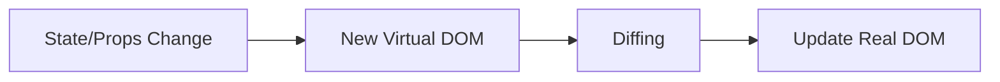

# React Core: Definitions, Interview Questions & Answers

## Table of Contents

- [JSX](#jsx)
- [Components](#components)
- [Props & State](#props--state)
- [Hooks](#hooks)
- [Lifecycle](#lifecycle)
- [Context](#context)
- [Reconciliation & Virtual DOM](#reconciliation--virtual-dom)
- [Key Prop](#key-prop)
- [Controlled vs Uncontrolled](#controlled-vs-uncontrolled)
- [Event Handling](#event-handling)
- [Performance Optimization](#performance-optimization)
- [Error Boundaries](#error-boundaries)
- [Code Splitting & Lazy Loading](#code-splitting--lazy-loading)
- [Testing](#testing)
- [Custom Hooks](#custom-hooks)
- [Common Patterns](#common-patterns)
- [Practice Problems](#practice-problems)

---

## JSX

**Definition:** JSX is a syntax extension for JavaScript that looks like HTML and is used to describe UI in React.

**Key Points:**

- Compiled to `React.createElement` calls by Babel.
- Allows embedding JS expressions with `{}`.
- Must return a single root element.

---

## Components

**Definition:** Reusable, self-contained building blocks of a React UI.

**Types:**

- Functional (with hooks)
- Class (legacy)
- Higher-order components (HOC)
- Render props

---

## Props & State

**Props:** Read-only data passed from parent to child.
**State:** Local, mutable data managed by the component.

**Key Points:**

- Props are immutable, set by parent.
- State is mutable, managed by the component.
- Use `useState` or `this.setState` to update state.

---

## Hooks

**Definition:** Functions that let you use state and other React features in functional components.

**Common Hooks:**

- `useState`, `useEffect`, `useContext`, `useReducer`, `useRef`, `useMemo`, `useCallback`.

**Rules:**

- Only call hooks at the top level of a function component.
- Only call hooks from React functions.

---

## Lifecycle

**Definition:** Phases a component goes through from creation to destruction.

**Class:** `componentDidMount`, `componentDidUpdate`, `componentWillUnmount`.
**Function:** Use `useEffect` for all lifecycle needs.

---

## Context

**Definition:** Provides a way to pass data through the component tree without props drilling.

**Usage:**

- Create context with `React.createContext()`
- Provide value with `<Provider>`
- Consume with `useContext` or `Context.Consumer`

---

## Reconciliation & Virtual DOM

**Definition:** React's process for updating the DOM efficiently.

**How it works:**

- State/props change → new Virtual DOM tree
- Diff with previous tree
- Only changed nodes are updated in the real DOM

**Diagram:**

---

## Key Prop

**Definition:** Unique identifier for list items to help React track changes.

**Best Practice:** Use stable, unique keys (not array index).

---

## Controlled vs Uncontrolled

**Controlled:** Form data managed by React state.
**Uncontrolled:** Form data managed by the DOM (useRef).

---

## Event Handling

- React uses a synthetic event system for cross-browser compatibility.
- Event handlers are camelCase (`onClick`).

---

## Performance Optimization

- Use `React.memo`, `useMemo`, `useCallback` to avoid unnecessary re-renders.
- Virtualize large lists (`react-window`).
- Code splitting and lazy loading.

---

## Error Boundaries

- Catch JS errors in child components and display fallback UI.
- Implement with class components using `componentDidCatch` and `getDerivedStateFromError`.

---

## Code Splitting & Lazy Loading

- Use `React.lazy` and `Suspense` for dynamic imports.
- Improves initial load time.

---

## Testing

- Use Jest and React Testing Library.
- Test rendering, user interactions, and output.

---

## Custom Hooks

- Encapsulate reusable logic (e.g., `useDebounce`, `useLocalStorage`).
- Follow the same rules as built-in hooks.

---

## Common Patterns

- **HOC:** Function that takes a component and returns a new one.
- **Render Props:** Pass a function as a prop to control rendering.
- **Compound Components:** Components that work together via context.

---

## Practice Problems

### 1. Create a reusable Modal component

### 2. Implement a drag-and-drop list

### 3. Build a form with validation

### 4. Implement virtual scrolling for a large list

### 5. Write a custom hook for localStorage

### 6. Create a custom hook for window size

### 7. Add keyboard shortcuts with a custom hook

### 8. Track network status with a custom hook

---

_This guide covers all base React concepts and key knowledge for interviews. Practice explaining, diagramming, and implementing each topic!_
