# 🧠 Frontend Theory & Visualizations

## 📋 Table of Contents

- [Core Concepts](#core-concepts)
- [JavaScript Engine & Runtime](#javascript-engine--runtime)
- [Browser Architecture](#browser-architecture)
- [Network & Performance](#network--performance)
- [Security Models](#security-models)
- [Visual Diagrams](#visual-diagrams)
- [Knowledge Graphs](#knowledge-graphs)

## 🎯 Core Concepts

### Frontend Architecture Overview

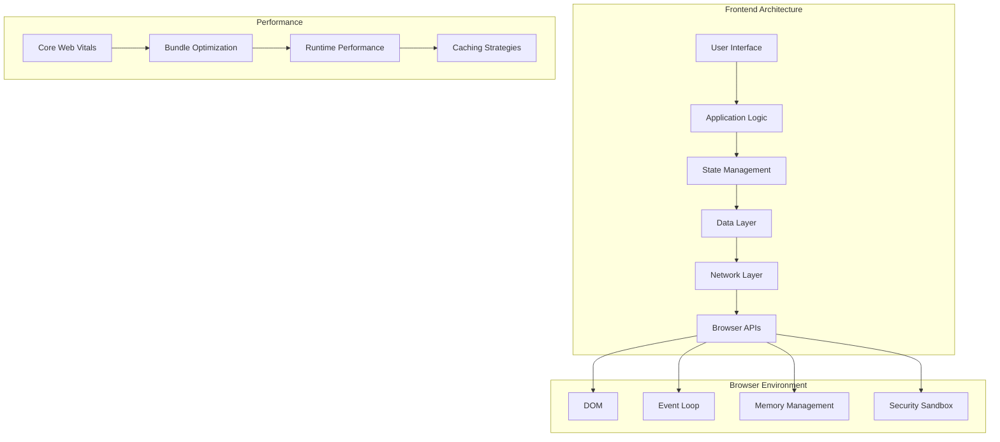

### Technology Stack Evolution

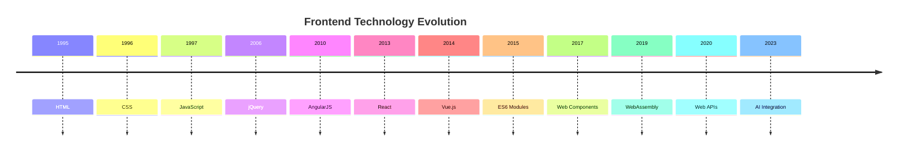

## 🚀 JavaScript Engine & Runtime

### JavaScript Engine Architecture

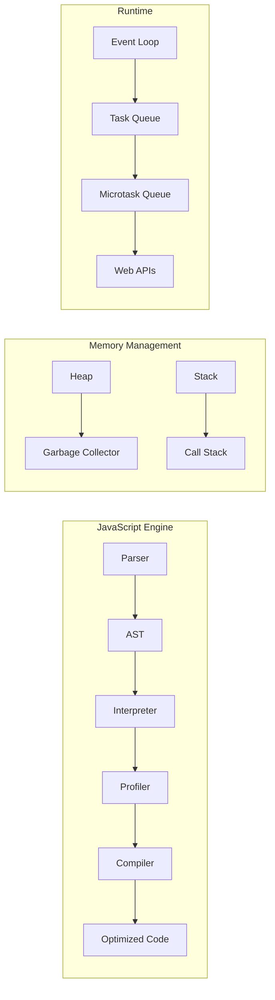

### Memory Management Deep Dive

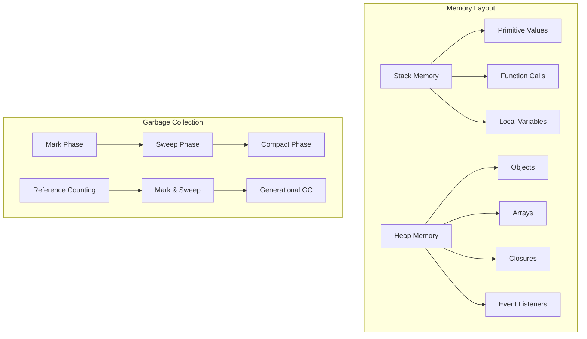

### Event Loop Visualization

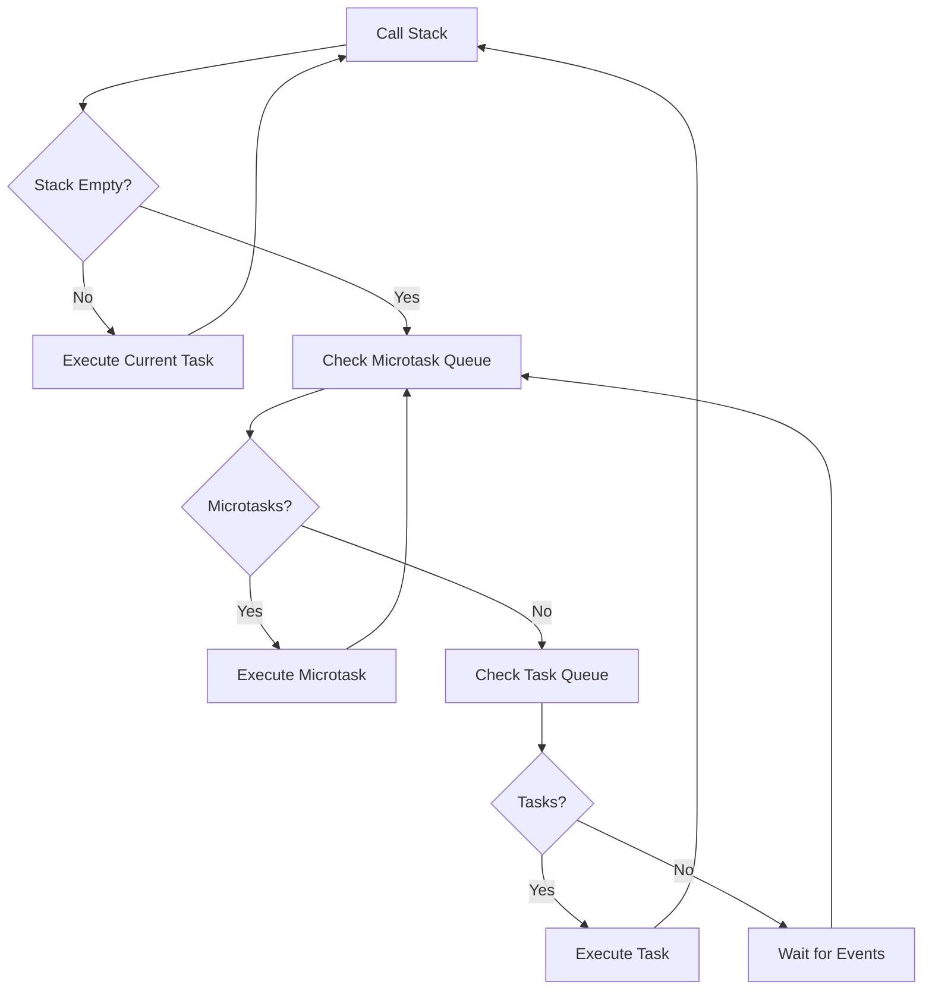

## 🌐 Browser Architecture

### Browser Rendering Pipeline

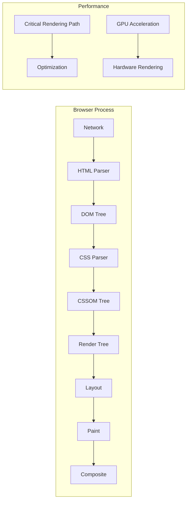

### DOM Tree Structure

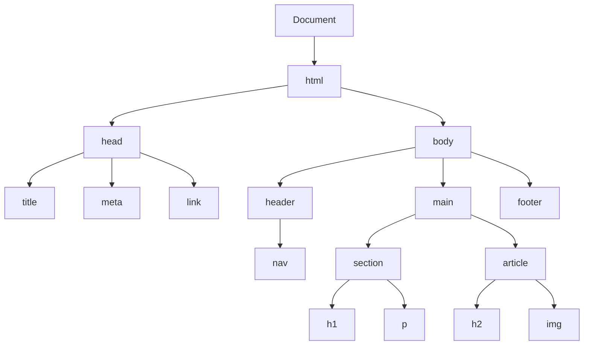

### CSSOM Construction

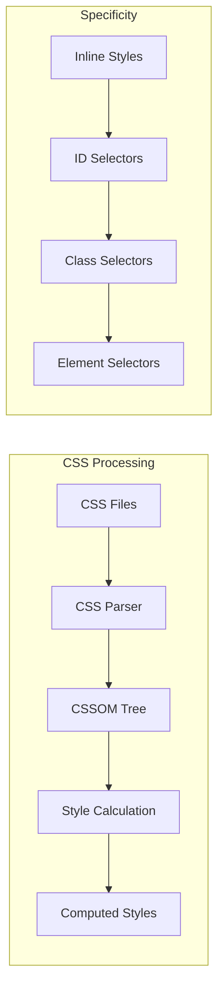

## ⚡ Network & Performance

### HTTP Request/Response Flow

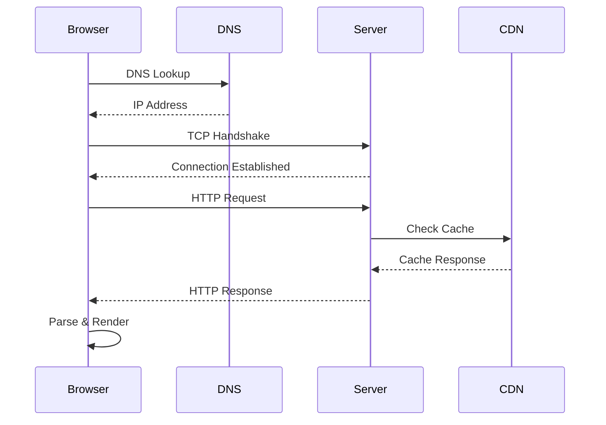

### Performance Optimization Strategies

```mermaid
graph TB
    subgraph "Loading Performance"
        A[Bundle Splitting] --> B[Code Splitting]
        B --> C[Tree Shaking]
        C --> D[Lazy Loading]
        D --> E[Preloading]
    end

    subgraph "Runtime Performance"
        F[Virtual DOM] --> G[Memoization]
        G --> H[Debouncing]
        H --> I[Throttling]
        I --> J[Web Workers]
    end

    subgraph "Caching"
        K[Browser Cache] --> L[Service Workers]
        L --> M[CDN Cache]
        M --> N[Application Cache]
    end
```

### Core Web Vitals

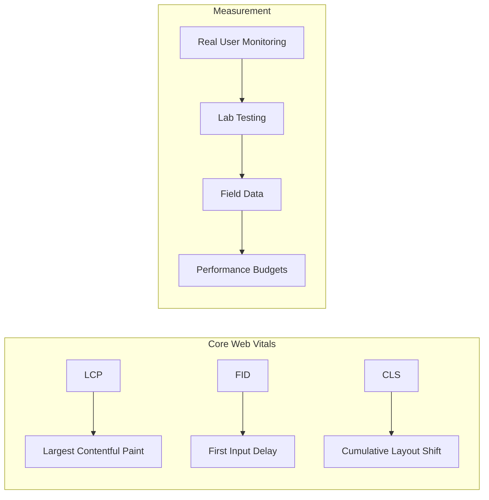

## 🔒 Security Models

### Browser Security Architecture

```mermaid
graph TB
    subgraph "Security Layers"
        A[Same-Origin Policy] --> B[Content Security Policy]
        B --> C[Cross-Origin Resource Sharing]
        C --> D[Subresource Integrity]
    end

    subgraph "Attack Prevention"
        E[XSS Protection] --> F[CSRF Protection]
        F --> G[Clickjacking Protection]
        G --> H[Secure Headers]
    end

    subgraph "Authentication"
        I[JWT Tokens] --> J[OAuth 2.0]
        J --> K[Session Management]
        K --> L[Multi-Factor Auth]
    end
```

### XSS Attack Vectors

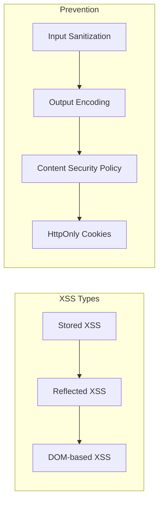

## 📊 Visual Diagrams

### State Management Patterns

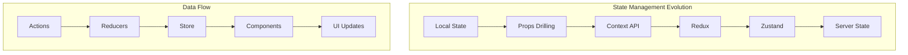

### Component Architecture

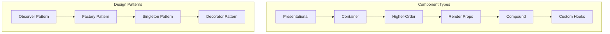

### Testing Pyramid

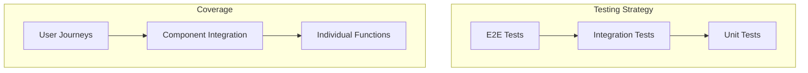

## 🧩 Knowledge Graphs

### Frontend Technology Relationships

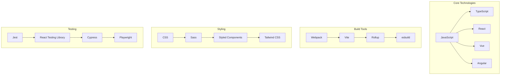

### Performance Optimization Map

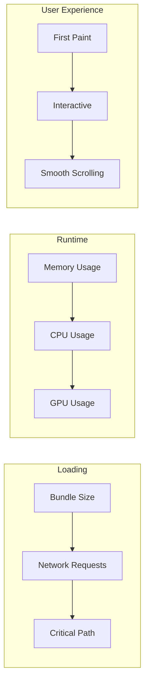

### Security Threat Model

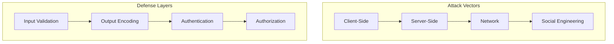

## 📚 Additional Resources

### Interactive Learning Tools

- **JavaScript Visualizer**: [pythontutor.com](http://pythontutor.com/javascript.html)
- **React DevTools**: Browser extension for React debugging
- **Chrome DevTools**: Built-in browser debugging tools
- **Lighthouse**: Performance and accessibility auditing

### Recommended Reading

1. **"JavaScript: The Definitive Guide"** by David Flanagan
2. **"You Don't Know JS"** series by Kyle Simpson
3. **"High Performance Browser Networking"** by Ilya Grigorik
4. **"Web Application Security"** by Andrew Hoffman

### Practice Platforms

- **Frontend Mentor**: Real-world design challenges
- **CodePen**: Interactive code examples
- **JSFiddle**: Quick prototyping
- **CodeSandbox**: Full-stack development environment

---

## 🎯 Next Steps

1. **Study the diagrams** to understand relationships between concepts
2. **Practice with interactive tools** to reinforce learning
3. **Build projects** that incorporate multiple concepts
4. **Review regularly** to maintain knowledge retention
5. **Stay updated** with latest browser features and best practices
