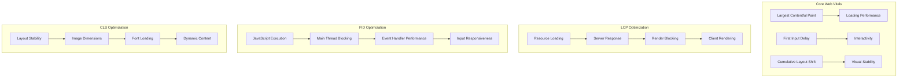

# Browser Performance Theory - Optimization Principles & Techniques

## ⚡ Core Web Vitals Deep Theory

### **What are Core Web Vitals?**
**Definition:** Core Web Vitals are a set of specific metrics that Google considers essential for measuring user experience on web pages, focusing on loading, interactivity, and visual stability.

**Why Core Web Vitals Matter:**
- **User Experience**: Directly correlate with user satisfaction and engagement
- **SEO Impact**: Google uses these metrics as ranking factors
- **Business Metrics**: Improved vitals lead to better conversion rates
- **Performance Standards**: Provide objective, measurable performance goals

**How Core Web Vitals Work:**



**Deep Theory with Examples:**
```javascript
// WHAT: Measuring Core Web Vitals
function measureCoreWebVitals() {
    // Largest Contentful Paint (LCP)
    new PerformanceObserver((entryList) => {
        const entries = entryList.getEntries();
        const lastEntry = entries[entries.length - 1];
        console.log('LCP:', lastEntry.startTime);
        
        // Good: < 2.5s, Needs Improvement: 2.5s-4s, Poor: > 4s
        if (lastEntry.startTime < 2500) {
            console.log('LCP: Good');
        } else if (lastEntry.startTime < 4000) {
            console.log('LCP: Needs Improvement');
        } else {
            console.log('LCP: Poor');
        }
    }).observe({ entryTypes: ['largest-contentful-paint'] });

    // First Input Delay (FID)
    new PerformanceObserver((entryList) => {
        for (const entry of entryList.getEntries()) {
            const FID = entry.processingStart - entry.startTime;
            console.log('FID:', FID);
            
            // Good: < 100ms, Needs Improvement: 100ms-300ms, Poor: > 300ms
            if (FID < 100) {
                console.log('FID: Good');
            } else if (FID < 300) {
                console.log('FID: Needs Improvement');
            } else {
                console.log('FID: Poor');
            }
        }
    }).observe({ entryTypes: ['first-input'] });

    // Cumulative Layout Shift (CLS)
    let clsValue = 0;
    new PerformanceObserver((entryList) => {
        for (const entry of entryList.getEntries()) {
            if (!entry.hadRecentInput) {
                clsValue += entry.value;
            }
        }
        console.log('CLS:', clsValue);
        
        // Good: < 0.1, Needs Improvement: 0.1-0.25, Poor: > 0.25
        if (clsValue < 0.1) {
            console.log('CLS: Good');
        } else if (clsValue < 0.25) {
            console.log('CLS: Needs Improvement');
        } else {
            console.log('CLS: Poor');
        }
    }).observe({ entryTypes: ['layout-shift'] });
}

// WHY: Performance optimization strategies
class PerformanceOptimizer {
    // LCP Optimization
    optimizeLCP() {
        // 1. Optimize server response times
        this.implementServerOptimizations();
        
        // 2. Eliminate render-blocking resources
        this.optimizeRenderBlocking();
        
        // 3. Optimize resource loading
        this.implementResourceOptimizations();
        
        // 4. Optimize client-side rendering
        this.optimizeClientRendering();
    }
    
    implementServerOptimizations() {
        // Use CDN for static assets
        // Implement server-side caching
        // Optimize database queries
        // Use HTTP/2 or HTTP/3
        
        return {
            cdn: 'CloudFlare/AWS CloudFront',
            caching: 'Redis/Memcached',
            database: 'Query optimization, indexing',
            protocol: 'HTTP/2 with server push'
        };
    }
    
    optimizeRenderBlocking() {
        // Critical CSS inlining
        const
</augment_code_snippet>