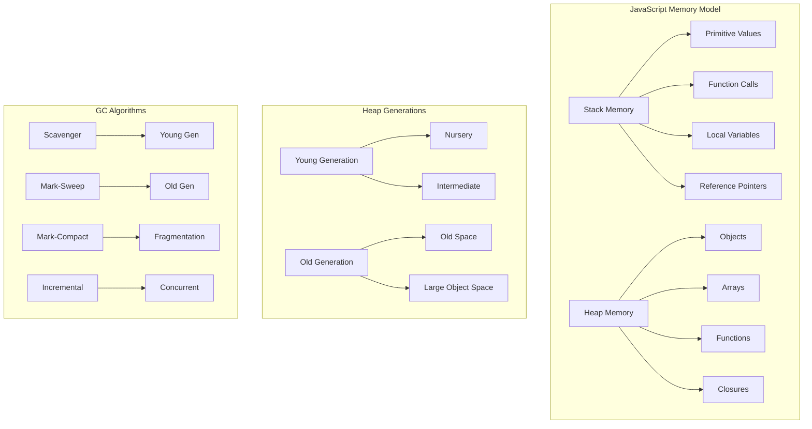
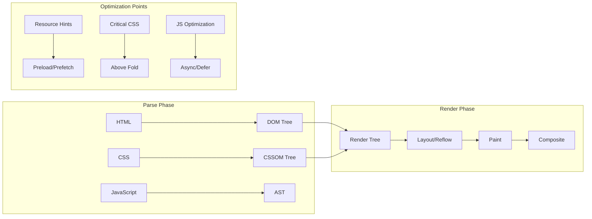
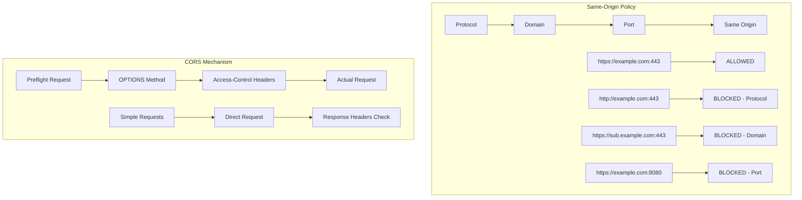
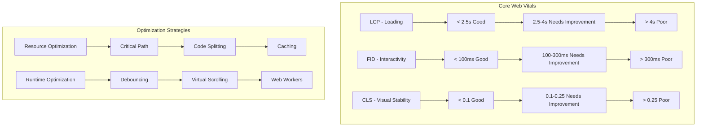

# JavaScript Engine Internals for FAANG Interviews

## 🚀 V8 Engine Architecture Deep Dive

### Compilation Pipeline Evolution


### Critical Interview Questions & Answers

#### Q1: "Explain how V8 optimizes JavaScript execution"

**Answer Framework:**
1. **Ignition Interpreter**: Fast startup, generates bytecode
2. **TurboFan Compiler**: Optimizes hot functions based on type feedback
3. **Inline Caching**: Speeds up property access
4. **Hidden Classes**: Optimizes object property access

**Detailed Explanation:**
```javascript
// Example: How V8 optimizes this function
function addNumbers(a, b) {
    return a + b;
}

// First calls: Interpreted by Ignition
addNumbers(1, 2);        // Type feedback: number + number
addNumbers(3, 4);        // Confirms pattern
addNumbers(5, 6);        // Still number + number

// After ~10 calls with same types: TurboFan optimizes
// Generates optimized machine code assuming number inputs

// Deoptimization trigger:
addNumbers("hello", "world"); // String concatenation - deoptimizes!
```

#### Q2: "What are Hidden Classes and why are they important?"

**Answer:**
Hidden Classes (Shapes/Maps) are V8's way of optimizing object property access by creating internal structures that track object layouts.

```javascript
// Same hidden class - GOOD
function Point(x, y) {
    this.x = x;  // Hidden class C0 -> C1 (adds x)
    this.y = y;  // Hidden class C1 -> C2 (adds y)
}

const p1 = new Point(1, 2);
const p2 = new Point(3, 4);
// Both share same hidden class C2

// Different hidden classes - BAD
const p3 = new Point(5, 6);
p3.z = 7;  // Creates new hidden class C3
// p3 now has different hidden class than p1, p2
```

#### Q3: "Explain JavaScript's memory model and garbage collection"

**Memory Layout:**


**Garbage Collection Deep Dive:**

1. **Generational Hypothesis**: Most objects die young
2. **Scavenger (Young Gen)**: Fast, copies live objects
3. **Mark-Sweep (Old Gen)**: Marks reachable objects, sweeps dead ones
4. **Incremental Marking**: Prevents pause times

```javascript
// Memory leak examples for interviews
// 1. Global variables
window.myGlobalArray = [];
function addData() {
    window.myGlobalArray.push(new Array(1000000)); // Never cleaned
}

// 2. Event listeners not removed
function setupListener() {
    const element = document.getElementById('button');
    const data = new Array(1000000);
    
    element.addEventListener('click', function() {
        console.log(data.length); // Closure keeps data alive
    });
    // Missing: element.removeEventListener
}

// 3. Timers not cleared
function startTimer() {
    const data = new Array(1000000);
    
    setInterval(function() {
        console.log(data.length); // data never released
    }, 1000);
    // Missing: clearInterval
}
```

## 🌐 Browser Rendering Engine Theory

### Critical Rendering Path Analysis



#### Q4: "What happens when you type a URL and press Enter?"

**Complete Answer Framework:**

1. **DNS Resolution**
   - Browser cache → OS cache → Router cache → ISP DNS → Root servers
   - DNS prefetching optimization

2. **TCP Connection**
   - Three-way handshake
   - TLS handshake for HTTPS
   - Connection pooling

3. **HTTP Request/Response**
   - Request headers, method, body
   - Response status, headers, body
   - HTTP/2 multiplexing benefits

4. **Browser Processing**
   ```mermaid
   graph TD
       A[Receive HTML] --> B[Parse HTML]
       B --> C[Build DOM]
       C --> D[Parse CSS]
       D --> E[Build CSSOM]
       E --> F[Combine into Render Tree]
       F --> G[Layout Calculation]
       G --> H[Paint Layers]
       H --> I[Composite Layers]
   ```

5. **JavaScript Execution**
   - Parser blocking vs non-blocking
   - Event loop integration
   - DOM manipulation effects

#### Q5: "Explain the difference between Layout, Paint, and Composite"

**Layout (Reflow):**
- Calculates position and size of elements
- Triggered by: changing dimensions, adding/removing elements, changing font size

**Paint:**
- Fills in pixels for each element
- Triggered by: color changes, background changes, text changes

**Composite:**
- Combines painted layers into final image
- GPU accelerated operations
- Triggered by: transforms, opacity, filters

```javascript
// Performance implications
// BAD - triggers layout, paint, composite
element.style.width = '100px';
element.style.height = '100px';

// BETTER - only triggers composite (GPU accelerated)
element.style.transform = 'scale(1.5)';
element.style.opacity = '0.5';

// BEST - batch DOM reads and writes
const width = element.offsetWidth;  // Read
const height = element.offsetHeight; // Read
element.style.width = width + 10 + 'px';  // Write
element.style.height = height + 10 + 'px'; // Write
```

## 🔄 Event Loop & Asynchronous JavaScript

### Event Loop Deep Dive

```mermaid
graph TD
    subgraph "JavaScript Runtime"
        A[Call Stack] --> B[Web APIs]
        B --> C[Callback Queue]
        C --> D[Event Loop]
        D --> A
        
        E[Microtask Queue] --> F[Event Loop Check]
        F --> A
    end

    subgraph "Priority Order"
        G[1. Call Stack] --> H[2. Microtasks]
        H --> I[3. Macrotasks]
        I --> J[4. Render]
    end

    subgraph "Microtasks"
        K[Promises] --> L[queueMicrotask]
        L --> M[MutationObserver]
    end

    subgraph "Macrotasks"
        N[setTimeout] --> O[setInterval]
        O --> P[I/O Operations]
        P --> Q[UI Events]
    end
```



#### Q6: "Explain the Event Loop and task prioritization"

**Answer with Examples:**

```javascript
console.log('1');

setTimeout(() => console.log('2'), 0);

Promise.resolve().then(() => console.log('3'));

queueMicrotask(() => console.log('4'));

console.log('5');

// Output: 1, 5, 3, 4, 2
// Explanation:
// 1. Synchronous code executes first (1, 5)
// 2. Microtasks execute before macrotasks (3, 4)
// 3. setTimeout callback executes last (2)
```

**Advanced Event Loop Example:**
```javascript
async function complexEventLoop() {
    console.log('A');
    
    setTimeout(() => console.log('B'), 0);
    
    await Promise.resolve();
    console.log('C');
    
    setTimeout(() => console.log('D'), 0);
    
    await new Promise(resolve => {
        console.log('E');
        resolve();
    });
    
    console.log('F');
}

complexEventLoop();
console.log('G');

// Output: A, G, C, E, F, B, D
```

## 🔒 Security Model Deep Dive

### Same-Origin Policy & CORS



#### Q7: "How does CORS work and why is it necessary?"

**Complete Answer:**

1. **Purpose**: Relaxes Same-Origin Policy for controlled cross-origin access
2. **Preflight Requests**: For complex requests (custom headers, non-simple methods)
3. **Response Headers**: Server indicates allowed origins, methods, headers

```javascript
// CORS Headers Explanation
// Server response headers:
{
  'Access-Control-Allow-Origin': 'https://trusted-site.com',
  'Access-Control-Allow-Methods': 'GET, POST, PUT, DELETE',
  'Access-Control-Allow-Headers': 'Content-Type, Authorization',
  'Access-Control-Allow-Credentials': 'true',
  'Access-Control-Max-Age': '86400' // Cache preflight for 24 hours
}

// Preflight request example
// Browser automatically sends:
OPTIONS /api/data HTTP/1.1
Origin: https://my-app.com
Access-Control-Request-Method: POST
Access-Control-Request-Headers: Content-Type, X-Custom-Header
```

### Content Security Policy (CSP)

#### Q8: "Explain CSP and its role in preventing XSS attacks"

**CSP Directives:**
```http
Content-Security-Policy: 
  default-src 'self';
  script-src 'self' 'unsafe-inline' https://trusted-cdn.com;
  style-src 'self' 'unsafe-inline';
  img-src 'self' data: https:;
  connect-src 'self' https://api.example.com;
  font-src 'self' https://fonts.googleapis.com;
  object-src 'none';
  media-src 'self';
  frame-src 'none';
  base-uri 'self';
  form-action 'self';
  upgrade-insecure-requests;
```

**XSS Prevention Mechanisms:**
1. **Reflected XSS**: Input validation, output encoding
2. **Stored XSS**: Server-side sanitization, CSP
3. **DOM-based XSS**: Avoid innerHTML, use textContent

## 📊 Performance Theory

### Web Vitals Deep Understanding



#### Q9: "How would you optimize a slow-loading web application?"

**Systematic Approach:**

1. **Measurement First**
   - Lighthouse audits
   - Real User Monitoring (RUM)
   - Synthetic testing

2. **Loading Performance**
   - Critical resource prioritization
   - Resource hints (preload, prefetch, preconnect)
   - Code splitting and lazy loading
   - Image optimization (WebP, AVIF, responsive images)

3. **Runtime Performance**
   - JavaScript optimization (tree shaking, minification)
   - CSS optimization (critical CSS, unused CSS removal)
   - Efficient algorithms and data structures
   - Memory leak prevention

4. **Caching Strategies**
   - Browser caching (Cache-Control headers)
   - CDN implementation
   - Service Worker caching
   - Application-level caching

## 🎯 FAANG Interview Success Framework

### Google: Technical Depth
- **Focus**: Algorithm efficiency, system scalability
- **Key Topics**: Performance optimization, accessibility, progressive enhancement
- **Sample Question**: "Design a performant infinite scroll component"

### Meta: User Experience
- **Focus**: Real-time features, mobile performance
- **Key Topics**: React internals, state management, WebSocket implementation
- **Sample Question**: "How would you implement real-time collaborative editing?"

### Amazon: Customer Obsession
- **Focus**: Reliability, cost optimization
- **Key Topics**: Error handling, monitoring, global scale considerations
- **Sample Question**: "Design a fault-tolerant frontend architecture"

### Microsoft: Innovation
- **Focus**: Cross-platform compatibility, accessibility
- **Key Topics**: Progressive Web Apps, TypeScript, modern web standards
- **Sample Question**: "How would you make a web app work offline?"

### Apple: Design Excellence
- **Focus**: User interface, performance, attention to detail
- **Key Topics**: Animation performance, responsive design, touch interactions
- **Sample Question**: "Optimize a complex animation for 60fps on mobile"

## 📚 Study Strategy for Theory Mastery

### Week 1-2: JavaScript Engine Fundamentals
- V8 compilation pipeline
- Memory management and GC
- Event loop and async behavior

### Week 3-4: Browser Architecture
- Rendering pipeline
- Network protocols
- Security models

### Week 5-6: Performance Theory
- Core Web Vitals
- Optimization techniques
- Measurement and monitoring

### Week 7-8: Advanced Concepts
- Modern web standards
- Progressive enhancement
- Accessibility principles

## 💡 Interview Preparation Tips

1. **Understand the "Why"**: Don't just memorize - understand the reasoning
2. **Connect Concepts**: Link different areas (e.g., how GC affects performance)
3. **Real-world Examples**: Relate theory to practical scenarios
4. **Trade-offs Discussion**: Always discuss pros/cons of different approaches
5. **Stay Current**: Follow web standards evolution and browser updates