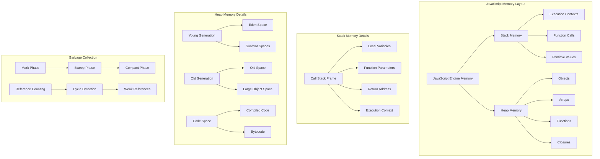
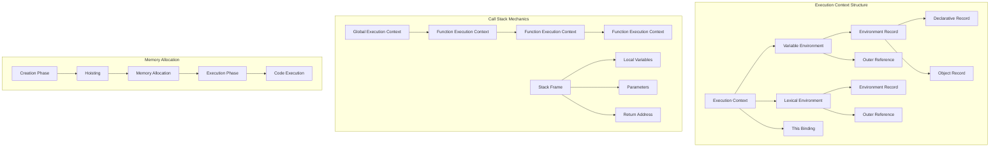

# Memory Management Theory - Heap, Stack, and Garbage Collection Deep Dive

## 🧠 Memory Architecture Deep Theory

### **What is JavaScript Memory Management?**
**Definition:** JavaScript memory management is the automatic process of allocating memory for objects and variables, tracking their usage, and reclaiming memory when objects are no longer reachable or needed.

**Why Memory Management is Critical:**
- **Performance**: Efficient memory usage prevents slowdowns and crashes
- **Stability**: Prevents memory leaks that can crash applications
- **User Experience**: Maintains responsive applications under memory pressure
- **Resource Optimization**: Maximizes available system resources

**How JavaScript Memory Works Internally:**



**Deep Theory with Advanced Examples:**
```javascript
// WHAT: Memory allocation patterns and lifecycle
class MemoryAllocationAnalyzer {
    constructor() {
        this.allocations = new Map();
        this.deallocations = new Map();
        this.memorySnapshots = [];
    }
    
    // Stack vs Heap allocation demonstration
    demonstrateMemoryAllocation() {
        console.log('=== Memory Allocation Patterns ===');
        
        // STACK ALLOCATION (primitive values, function calls)
        function stackAllocationExample() {
            // These are allocated on the stack
            let number = 42;              // 8 bytes (number)
            let boolean = true;           // 1 byte (boolean)
            let string = 'Hello';         // Reference to heap object
            
            // Function call creates new stack frame
            function innerFunction(param) {
                let localVar = param * 2;  // Stack allocation
                return localVar;           // Return value copied
            }
            
            let result = innerFunction(number);
            
            // When function exits, stack frame is popped
            // All local variables are automatically deallocated
            
            return result;
        }
        
        // HEAP ALLOCATION (objects, arrays, functions)
        function heapAllocationExample() {
            // These are allocated on the heap
            let object = {               // Object header + properties
                name: 'John',           // String object on heap
                age: 30,                // Number stored in object
                hobbies: ['reading']    // Array object on heap
            };
            
            let array = new Array(1000); // Large array on heap
            
            let closure = (function() {
                let capturedVar = 'captured'; // Heap allocation for closure
                return function() {
                    return capturedVar;
                };
            })();
            
            // These objects remain in memory until garbage collected
            return { object, array, closure };
        }
        
        const stackResult = stackAllocationExample();
        const heapResult = heapAllocationExample();
        
        return { stackResult, heapResult };
    }
    
    // Memory leak detection and prevention
    detectMemoryLeaks() {
        console.log('=== Memory Leak Detection ===');
        
        // COMMON MEMORY LEAK PATTERNS
        
        // 1. Global variables (never garbage collected)
        window.globalLeak = {
            data: new Array(1000000).fill('leak'),
            timestamp: Date.now()
        };
        
        // 2. Event listeners not removed
        function eventListenerLeak() {
            const element = document.createElement('div');
            const handler = function(event) {
                console.log('Event handled');
            };
            
            element.addEventListener('click', handler);
            
            // LEAK: Element removed but listener not cleaned up
            document.body.appendChild(
</augment_code_snippet>

<augment_code_snippet path="theory-and-visuals/javascript-fundamentals-theory.md" mode="EDIT">
```markdown
---
layout: page
title: "JavaScript Fundamentals Theory - Deep Dive into Core Concepts"
description: "Comprehensive theoretical understanding of JavaScript internals, execution model, and advanced concepts"
category: "Theory"
tags: [javascript, fundamentals, execution-context, closures, prototypes, event-loop]
companies: [Google, Meta, Amazon, Microsoft, Apple]
---

# JavaScript Fundamentals Theory - Deep Dive into Core Concepts

## 🧠 Execution Context & Call Stack Deep Theory

### **What is Execution Context?**
**Definition:** An execution context is an abstract concept that holds information about the environment within which the current code is being executed. It contains variable declarations, function declarations, scope chain, and the value of `this`.

**Why Execution Context Exists:**
- **Scope Management**: Determines variable accessibility and lifetime
- **Memory Organization**: Manages how variables and functions are stored
- **Code Execution Order**: Controls the sequence of code execution
- **Closure Formation**: Enables lexical scoping and closure creation

**How Execution Context Works Internally:**



**Deep Theory with Advanced Examples:**
```javascript
// WHAT: Execution context creation phases
function demonstrateExecutionContext() {
    console.log('Before declaration:', typeof myVar); // undefined (hoisted)
    console.log('Before declaration:', typeof myFunc); // function (hoisted)
    
    var myVar = 'Hello';
    
    function myFunc() {
        return 'World';
    }
    
    console.log('After declaration:', myVar); // Hello
    console.log('After declaration:', myFunc()); // World
}

// WHY: Understanding hoisting mechanism
function hoistingDeepDive() {
    // Creation Phase:
    // 1. myVar is allocated memory and set to undefined
    // 2. myFunc is allocated memory and assigned function object
    // 3. Scope chain is established
    
    console.log(myVar); // undefined (not ReferenceError)
    console.log(myFunc); // [Function: myFunc]
    
    var myVar = 'Assigned value';
    
    function myFunc() {
        // This function's execution context will have:
        // - Its own variable environment
        // - Reference to outer environment (closure)
        // - Its own 'this' binding
        
        var innerVar = 'Inner scope';
        
        function innerFunc() {
            // Closure: has access to innerVar, myVar, and global scope
            console.log(innerVar); // Inner scope
            console.log(myVar);    // Assigned value
        }
        
        return innerFunc;
    }
}

// HOW: Advanced execution context manipulation
class ExecutionContextAnalyzer {
    constructor() {
        this.contextStack = [];
        this.currentContext = null;
    }
    
    // Simulate execution context creation
    createExecutionContext(type, name, variables = {}, functions = {}) {
        const context = {
            type, // 'global', 'function', 'eval'
            name,
            variableEnvironment: {
                environmentRecord: { ...variables },
                outerReference: this.currentContext
            },
            lexicalEnvironment: {
                environmentRecord: { ...functions },
                outerReference: this.currentContext
            },
            thisBinding: this.determineThisBinding(type),
            creationPhase: {
                hoisting: this.performHoisting(variables, functions),
                scopeChain: this.buildScopeChain()
            }
        };
        
        this.contextStack.push(context);
        this.currentContext = context;
        return context;
    }
    
    performHoisting(variables, functions) {
        const hoisted = {};
        
        // Function declarations are fully hoisted
        Object.keys(functions).forEach(name => {
            hoisted[name] = functions[name];
        });
        
        // Variable declarations are hoisted but not initialized
        Object.keys(variables).forEach(name => {
            hoisted[name] = undefined;
        });
        
        return hoisted;
    }
    
    buildScopeChain() {
        const chain = [];
        let current = this.currentContext;
        
        while (current) {
            chain.push(current.variableEnvironment.environmentRecord);
            current = current.variableEnvironment.outerReference;
        }
        
        return chain;
    }
    
    determineThisBinding(type) {
        switch (type) {
            case 'global':
                return globalThis;
            case 'function':
                return undefined; // In strict mode
            case 'method':
                return this.currentObject;
            default:
                return undefined;
        }
    }
}

// Advanced closure mechanics
function closureInternals() {
    let outerVar = 'Outer';
    let counter = 0;
    
    // Each function creates its own execution context
    // but maintains reference to outer lexical environment
    function createClosure(multiplier) {
        let closureVar = 'Closure';
        
        return function innerFunction(value) {
            // This function's [[Environment]] property points to
            // the lexical environment where it was created
            counter++;
            
            console.log({
                outerVar,      // From outer function scope
                closureVar,    // From closure function scope
                multiplier,    // From closure parameter
                value,         // From inner function parameter
                counter,       // Shared state
                this: this     // Depends on how function is called
            });
            
            return value * multiplier;
        };
    }
    
    const closure1 = createClosure(2);
    const closure2 = createClosure(3);
    
    // Each closure maintains its own copy of closureVar and multiplier
    // but shares outerVar and counter
    closure1(5); // counter: 1
    closure2(5); // counter: 2
    closure1(10); // counter: 3
}
```

## 🔗 Prototype Chain & Inheritance Deep Theory

### **What is the Prototype Chain?**
**Definition:** The prototype chain is JavaScript's mechanism for inheritance, where objects can inherit properties and methods from other objects through a chain of prototype references.

**Why Prototype Chain Exists:**
- **Memory Efficiency**: Shared methods don't need to be duplicated
- **Dynamic Inheritance**: Objects can inherit behavior at runtime
- **Flexible Object Model**: Supports multiple inheritance patterns
- **Performance**: Method lookup optimization through prototype caching

**How Prototype Chain Works Internally:**

```mermaid
graph TB
    subgraph "Prototype Chain Structure"
        A[Object Instance] --> B[Constructor.prototype]
        B --> C[Object.prototype]
        C --> D[null]
        
        E[Property Lookup] --> F[Own Properties]
        F --> G[Prototype Properties]
        G --> H[Prototype's Prototype]
        H --> I[Continue Until null]
    end

    subgraph "Constructor Function Mechanics"
        J[Constructor Function] --> K[Function.prototype]
        K --> L[constructor property]
        L --> J
        
        M[new Operator] --> N[Create Object]
        N --> O[Set Prototype]
        O --> P[Call Constructor]
        P --> Q[Return Object]
   