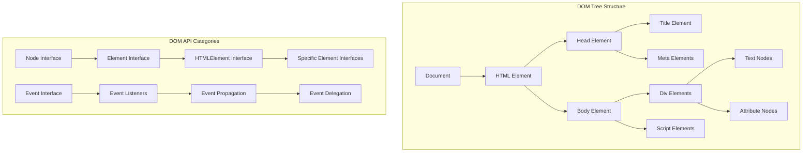
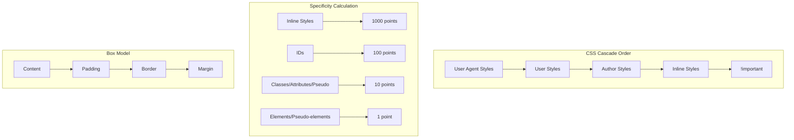
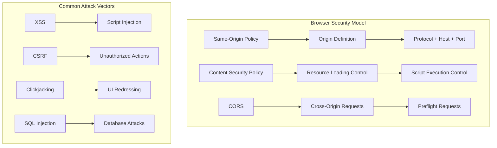
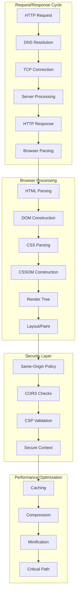

# Web Fundamentals Theory - Core Concepts & Interconnections

## 🌐 HTTP Protocol Deep Theory

### **What is HTTP?**
**Definition:** HTTP (HyperText Transfer Protocol) is a stateless, application-layer protocol that defines how messages are formatted and transmitted between web clients and servers.

**Why HTTP Exists:**
- **Standardization**: Universal communication protocol for the web
- **Simplicity**: Text-based, human-readable protocol
- **Statelessness**: Each request is independent, enabling scalability
- **Extensibility**: Headers allow for protocol evolution

**How HTTP Works Fundamentally:**


**Deep Theory with Examples:**
```javascript
// WHAT: HTTP request anatomy
const httpRequest = {
    method: 'POST',
    url: 'https://api.example.com/users',
    headers: {
        'Content-Type': 'application/json',
        'Authorization': 'Bearer token123',
        'Accept': 'application/json',
        'User-Agent': 'Mozilla/5.0...',
        'Cache-Control': 'no-cache'
    },
    body: JSON.stringify({
        name: 'John Doe',
        email: 'john@example.com'
    })
};

// WHY: Statelessness implications
// Each request must contain all necessary information
fetch('/api/user/profile', {
    headers: {
        'Authorization': 'Bearer ' + token, // Must include auth every time
        'Content-Type': 'application/json'
    }
});

// HOW: HTTP methods semantic meaning
const httpMethods = {
    GET: {
        purpose: 'Retrieve data',
        idempotent: true,
        safe: true,
        cacheable: true,
        example: 'GET /api/users/123'
    },
    POST: {
        purpose: 'Create new resource',
        idempotent: false,
        safe: false,
        cacheable: false,
        example: 'POST /api/users'
    },
    PUT: {
        purpose: 'Update/replace entire resource',
        idempotent: true,
        safe: false,
        cacheable: false,
        example: 'PUT /api/users/123'
    },
    PATCH: {
        purpose: 'Partial update',
        idempotent: false,
        safe: false,
        cacheable: false,
        example: 'PATCH /api/users/123'
    },
    DELETE: {
        purpose: 'Remove resource',
        idempotent: true,
        safe: false,
        cacheable: false,
        example: 'DELETE /api/users/123'
    }
};

// Status code categories and their meanings
const statusCodes = {
    '1xx': 'Informational - Request received, continuing process',
    '2xx': 'Success - Request successfully received, understood, accepted',
    '3xx': 'Redirection - Further action needed to complete request',
    '4xx': 'Client Error - Request contains bad syntax or cannot be fulfilled',
    '5xx': 'Server Error - Server failed to fulfill valid request'
};
```

**Interconnected Concepts:**
- **TCP/IP Stack**: Underlying transport mechanism
- **DNS Resolution**: Domain name to IP address mapping
- **TLS/SSL**: Security layer for HTTPS
- **Caching**: HTTP cache headers and strategies

## 🏗️ DOM (Document Object Model) Theory

### **What is the DOM?**
**Definition:** The DOM is a programming interface that represents HTML/XML documents as a tree structure of objects that can be manipulated with JavaScript.

**Why DOM Exists:**
- **Dynamic Content**: Enable runtime modification of web pages
- **Event Handling**: Respond to user interactions
- **API Standardization**: Consistent interface across browsers
- **Separation of Concerns**: Structure (HTML) separate from behavior (JS)

**How DOM Works Internally:**



**Deep Theory with Examples:**
```javascript
// WHAT: DOM node types and hierarchy
const nodeTypes = {
    ELEMENT_NODE: 1,        // <div>, <p>, etc.
    TEXT_NODE: 3,           // Text content
    COMMENT_NODE: 8,        // <!-- comments -->
    DOCUMENT_NODE: 9,       // document object
    DOCUMENT_FRAGMENT_NODE: 11  // DocumentFragment
};

// WHY: Different node types serve different purposes
function analyzeNode(node) {
    switch(node.nodeType) {
        case Node.ELEMENT_NODE:
            console.log(`Element: ${node.tagName}`);
            console.log(`Attributes: ${node.attributes.length}`);
            break;
        case Node.TEXT_NODE:
            console.log(`Text: "${node.textContent.trim()}"`);
            break;
        case Node.COMMENT_NODE:
            console.log(`Comment: ${node.textContent}`);
            break;
    }
}

// HOW: DOM manipulation performance considerations
// INEFFICIENT: Multiple DOM queries and modifications
function inefficientDOMUpdate(items) {
    const container = document.getElementById('container');
    
    for (let item of items) {
        const div = document.createElement('div');
        div.textContent = item.name;
        div.className = 'item';
        container.appendChild(div); // Triggers reflow each time
    }
}

// EFFICIENT: Batch DOM operations
function efficientDOMUpdate(items) {
    const container = document.getElementById('container');
    const fragment = document.createDocumentFragment();
    
    for (let item of items) {
        const div = document.createElement('div');
        div.textContent = item.name;
        div.className = 'item';
        fragment.appendChild(div); // No reflow yet
    }
    
    container.appendChild(fragment); // Single reflow
}

// Event delegation for performance
function setupEventDelegation() {
    // Instead of adding listeners to each item
    document.getElementById('container').addEventListener('click', (event) => {
        if (event.target.classList.contains('item')) {
            handleItemClick(event.target);
        }
    });
}

// Virtual DOM concept (simplified)
class VirtualNode {
    constructor(tag, props = {}, children = []) {
        this.tag = tag;
        this.props = props;
        this.children = children;
    }
    
    render() {
        const element = document.createElement(this.tag);
        
        // Set properties
        Object.keys(this.props).forEach(key => {
            if (key === 'className') {
                element.className = this.props[key];
            } else if (key.startsWith('on')) {
                element.addEventListener(key.slice(2).toLowerCase(), this.props[key]);
            } else {
                element.setAttribute(key, this.props[key]);
            }
        });
        
        // Render children
        this.children.forEach(child => {
            if (typeof child === 'string') {
                element.appendChild(document.createTextNode(child));
            } else {
                element.appendChild(child.render());
            }
        });
        
        return element;
    }
}
```

**Interconnected Concepts:**
- **Event Loop**: How DOM events are processed
- **Rendering Pipeline**: How DOM changes trigger reflows/repaints
- **Memory Management**: DOM node lifecycle and garbage collection
- **Performance**: Virtual DOM and reconciliation algorithms

## 🎨 CSS Theory & Cascade

### **What is CSS?**
**Definition:** CSS (Cascading Style Sheets) is a declarative language that describes the presentation and layout of HTML documents through a system of selectors, properties, and values.

**Why CSS Exists:**
- **Separation of Concerns**: Separate content from presentation
- **Reusability**: Style rules can be applied to multiple elements
- **Maintainability**: Centralized styling makes updates easier
- **Responsive Design**: Adapt layouts to different screen sizes

**How CSS Cascade Works:**



**Deep Theory with Examples:**
```css
/* WHAT: Specificity calculation examples */
/* Specificity: 0,0,0,1 (1 point) */
p { color: blue; }

/* Specificity: 0,0,1,1 (11 points) */
p.highlight { color: red; }

/* Specificity: 0,1,0,1 (101 points) */
#main p { color: green; }

/* Specificity: 1,0,0,0 (1000 points) */
p { color: purple !important; }

/* WHY: Cascade resolves conflicts predictably */
.button {
    background: blue;     /* Base style */
    padding: 10px;
    border: none;
}

.button.primary {        /* More specific */
    background: green;    /* Overrides blue */
}

.button.primary.large {  /* Most specific */
    padding: 20px;       /* Overrides 10px */
}

/* HOW: CSS layout algorithms work */
.container {
    display: flex;           /* Establishes flex formatting context */
    flex-direction: row;     /* Main axis direction */
    justify-content: center; /* Main axis alignment */
    align-items: center;     /* Cross axis alignment */
}

.grid-container {
    display: grid;
    grid-template-columns: repeat(auto-fit, minmax(250px, 1fr));
    gap: 20px;
}

/* CSS Custom Properties (Variables) */
:root {
    --primary-color: #007bff;
    --spacing-unit: 8px;
    --border-radius: 4px;
}

.component {
    color: var(--primary-color);
    padding: calc(var(--spacing-unit) * 2);
    border-radius: var(--border-radius);
}
```

```javascript
// HOW: CSS-in-JS and dynamic styling
function createStyledComponent(styles) {
    return function StyledComponent({ children, ...props }) {
        const element = document.createElement('div');
        
        // Apply base styles
        Object.assign(element.style, styles);
        
        // Apply dynamic styles based on props
        if (props.primary) {
            element.style.backgroundColor = 'var(--primary-color)';
        }
        
        if (props.size === 'large') {
            element.style.padding = 'calc(var(--spacing-unit) * 3)';
        }
        
        element.appendChild(children);
        return element;
    };
}

// CSS performance optimization
function optimizeCSS() {
    // Minimize reflows and repaints
    const element = document.getElementById('animated-element');
    
    // BAD: Causes multiple reflows
    element.style.left = '100px';
    element.style.top = '100px';
    element.style.width = '200px';
    element.style.height = '200px';
    
    // GOOD: Batch style changes
    element.style.cssText = 'left: 100px; top: 100px; width: 200px; height: 200px;';
    
    // BETTER: Use CSS classes for complex changes
    element.className = 'optimized-position';
}
```

**Interconnected Concepts:**
- **Rendering Pipeline**: How CSS affects layout and paint
- **Performance**: Reflow/repaint optimization
- **Responsive Design**: Media queries and flexible layouts
- **Accessibility**: CSS impact on screen readers and navigation

## 🔒 Web Security Fundamentals

### **What is Web Security?**
**Definition:** Web security encompasses the practices, technologies, and policies designed to protect web applications, users, and data from various threats and vulnerabilities.

**Why Web Security is Critical:**
- **Data Protection**: Safeguard sensitive user information
- **Trust**: Maintain user confidence in web applications
- **Compliance**: Meet regulatory requirements (GDPR, CCPA)
- **Business Continuity**: Prevent attacks that could disrupt operations

**How Security Models Work:**



**Deep Theory with Examples:**
```javascript
// WHAT: Same-Origin Policy enforcement
const origins = {
    'https://example.com:443': {
        protocol: 'https:',
        hostname: 'example.com',
        port: '443'
    },
    'https://api.example.com:443': {
        protocol: 'https:',
        hostname: 'api.example.com', // Different hostname
        port: '443'
    },
    'http://example.com:80': {
        protocol: 'http:', // Different protocol
        hostname: 'example.com',
        port: '80'
    }
};

function isSameOrigin(url1, url2) {
    const origin1 = new URL(url1);
    const origin2 = new URL(url2);
    
    return origin1.protocol === origin2.protocol &&
           origin1.hostname === origin2.hostname &&
           origin1.port === origin2.port;
}

// WHY: XSS prevention strategies
function sanitizeInput(userInput) {
    // HTML entity encoding
    return userInput
        .replace(/&/g, '&amp;')
        .replace(/</g, '&lt;')
        .replace(/>/g, '&gt;')
        .replace(/"/g, '&quot;')
        .replace(/'/g, '&#x27;');
}

// Content Security Policy implementation
const cspHeader = {
    "Content-Security-Policy": `
        default-src 'self';
        script-src 'self' 'unsafe-inline' https://cdn.trusted.com;
        style-src 'self' 'unsafe-inline' https://fonts.googleapis.com;
        img-src 'self' data: https:;
        font-src 'self' https://fonts.gstatic.com;
        connect-src 'self' https://api.example.com;
        frame-src 'none';
        object-src 'none';
    `.replace(/\s+/g, ' ').trim()
};

// HOW: CSRF protection implementation
function generateCSRFToken() {
    const array = new Uint8Array(32);
    crypto.getRandomValues(array);
    return Array.from(array, byte => byte.toString(16).padStart(2, '0')).join('');
}

function validateCSRFToken(token, sessionToken) {
    // Constant-time comparison to prevent timing attacks
    if (token.length !== sessionToken.length) {
        return false;
    }
    
    let result = 0;
    for (let i = 0; i < token.length; i++) {
        result |= token.charCodeAt(i) ^ sessionToken.charCodeAt(i);
    }
    
    return result === 0;
}

// Secure cookie configuration
function setSecureCookie(name, value, options = {}) {
    const cookieOptions = {
        httpOnly: true,     // Prevent XSS access
        secure: true,       // HTTPS only
        sameSite: 'Strict', // CSRF protection
        maxAge: 3600,       // 1 hour expiration
        ...options
    };
    
    let cookieString = `${name}=${value}`;
    
    if (cookieOptions.httpOnly) cookieString += '; HttpOnly';
    if (cookieOptions.secure) cookieString += '; Secure';
    if (cookieOptions.sameSite) cookieString += `; SameSite=${cookieOptions.sameSite}`;
    if (cookieOptions.maxAge) cookieString += `; Max-Age=${cookieOptions.maxAge}`;
    
    document.cookie = cookieString;
}
```

**Interconnected Concepts:**
- **HTTP Headers**: Security-related headers and their purposes
- **Authentication**: Token-based and session-based authentication
- **Encryption**: TLS/SSL and data protection in transit
- **Browser APIs**: Secure contexts and permission models

## 🔄 Knowledge Integration Framework

### **How Web Fundamentals Connect:**



### **Interview Success Strategies:**

1. **Start with Fundamentals**: Always explain the basic concepts first
2. **Show Interconnections**: Demonstrate how concepts relate to each other
3. **Provide Examples**: Use concrete code examples to illustrate points
4. **Discuss Trade-offs**: Analyze pros and cons of different approaches
5. **Connect to Performance**: Explain how concepts impact application performance
6. **Address Security**: Consider security implications of design decisions

This comprehensive understanding of web fundamentals provides the foundation for advanced frontend development and successful technical interviews.